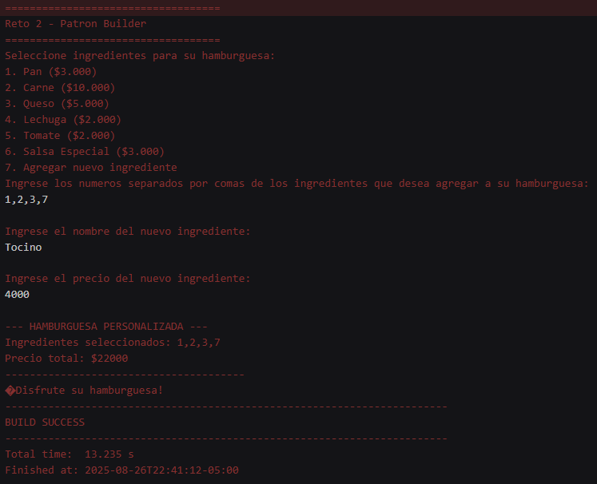

# Laboratorio 02 -SOLID, Patrones de diseño y UML

**Integrantes**
- Daniel Patiño Mejia
- Juan Felipe Rangel
- Ana Gabrile Fiquitiva

**feature/PatiñoDaniel_FiquitivaAna_RangelJuan_2025-2**

---

##Retos Completados

###Reto 1:
- **Tipo de patron:** 
- **Patron:** 
- **Imagen:** 

###Reto 2:
- **Tipo de patron:** Creacional
- **Patron:** Builder
- **Imagen:** 

###Reto 3:
- **Tipo de patron:** 
- **Patron:** 
- **Imagen:** 

###Reto 4:
- **Tipo de patron:** 
- **Patron:** 
- **Imagen:** 

###Reto 5:
- **Tipo de patron:** 
- **Patron:** 
- **Imagen:** 

###Reto 6:
- **Tipo de patron:** 
- **Patron:** 
- **Imagen:** 

###Reto 7:
- **Tipo de patron:** 
- **Patron:** 
- **Imagen:** 

###Reto 8:
- **Tipo de patron:** 
- **Patron:** 
- **Imagen:** 