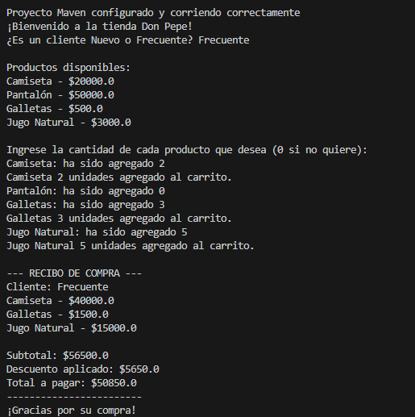
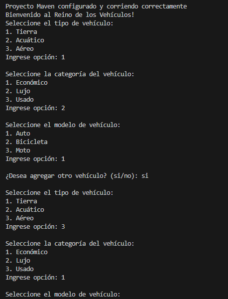
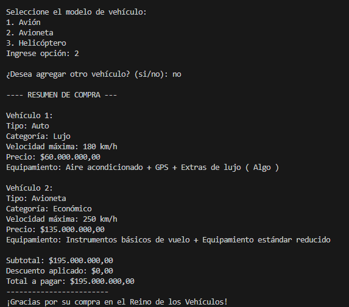
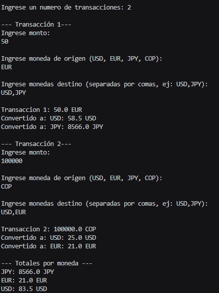
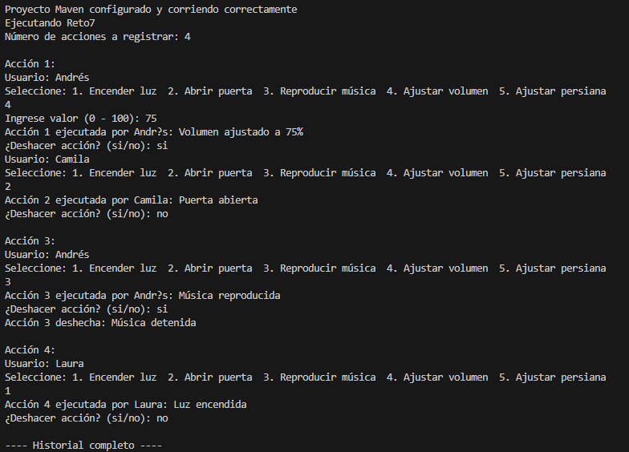
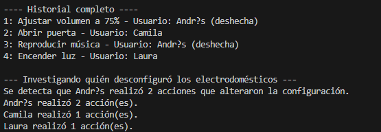
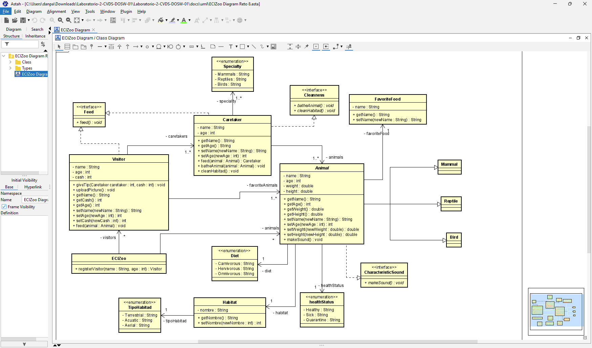

# 🧩 Laboratorio 02 - SOLID, Patrones de Diseño y UML

## 👥 Integrantes
- Daniel Patiño Mejia  
- Juan Felipe Rangel  
- Ana Gabriela Fiquitiva  

📌 Rama de trabajo: **feature/PatiñoDaniel_FiquitivaAna_RangelJuan_2025-2**

---

## ✅ Retos Completados

###Reto 1:
- **Tipo de patron:** Comportamiento
- **Patron:** Patron Strategy
- **Justificacion**:
El código cumple con los requisitos del reto, implementando correctamente el uso de **streams** en la clase `CarritoCompras.java` para calcular el subtotal utilizando `mapToDouble` y `sum()`. Además, se aplica el principio de **Responsabilidad Única**, ya que la clase `CarritoCompras` se encarga exclusivamente de gestionar los productos en el carrito y aplicar descuentos, mientras que las estrategias de descuento se delegan a la interfaz `EstrategiaDescuento`. Se observa un uso de **polimorfismo** al cambiar entre diferentes tipos de descuentos sin modificar la clase `CarritoCompras`, y el principio de **Abierto/Cerrado** se cumple al permitir la extensión de nuevas estrategias sin modificar el código existente.

En cuanto a los principios de **encapsulamiento**, los atributos como `cliente` y `items` son `private final`, lo que garantiza su protección y evita modificaciones externas. El precio unitario de los productos está declarado como `final` en la clase `Producto.java`, asegurando que no pueda ser alterado una vez asignado. Por último, se cumple con el requisito de descuentos al aplicar un 5% para clientes nuevos y un 10% para clientes antiguos, utilizando las clases `DescuentoClienteFrecuente.java` y `DescuentoClienteNuevo.java`, lo que hace que el sistema sea flexible y fácilmente extensible.

Adicionalmente el patrón de diseño utilizado en este reto es el **Patrón Estrategia**. Este patrón se emplea para definir una familia de algoritmos (en este caso, las estrategias de descuento) y hacerlas intercambiables. En la implementación, la interfaz `EstrategiaDescuento` permite que las clases `DescuentoClienteFrecuente` y `DescuentoClienteNuevo` proporcionen su propio cálculo de descuento. La clase `CarritoCompras` utiliza una instancia de `EstrategiaDescuento` para aplicar el descuento adecuado al total de la compra, lo que permite cambiar la estrategia de descuento de manera dinámica sin modificar la clase `CarritoCompras`. Este patrón facilita la extensión del sistema, ya que se pueden agregar nuevas estrategias de descuento sin alterar el código existente.

- **Imagen:** 

---

### 🔹 Reto 2
- **Tipo de patrón:** Creacional  
- **Patrón:** Builder  
- **Justificación:**  
  Elegimos este patrón ya que nos permite construir distintos tipos y representaciones del objeto.  
  En este caso, como todas las hamburguesas no tienen los mismos ingredientes, se implementó una clase **Builder** donde se pueden elegir los ingredientes para construir el objeto hamburguesa.  
- **Imagen:**  
  

---

### 🔹 Reto 3
- **Tipo de patron:**  Creacional
- **Patron:** FactoryMethod
- **Justificacion**:
El patrón Factory se utiliza para delegar la creación de objetos a una clase especializada (en este caso, VehiculoFactory), permitiendo que se instancien diferentes tipos de vehículos sin que el código cliente tenga que preocuparse por los detalles de su creación. Esto mejora la flexibilidad y el mantenimiento del código. El método crearPorModelo en la clase VehiculoFactory crea instancias de diferentes tipos de vehículos según el modelo que se pase como parámetro. Este enfoque asegura que el código cliente solo tenga que llamar al método de la fábrica y no tenga que gestionar la creación de objetos de manera directa.

- **Imagen:** 

---

### 🔹 Reto 4
- **Tipo de patrón:** Comportamiento  
- **Patrón:** Strategy  
- **Justificación:**  
  La razón por la cual utilizamos **Strategy** fue porque teníamos que implementar una lógica distinta para cada tipo de conversión.  
  Lo que se hizo fue implementar una **interfaz con el método `convertir`**, y se crearon múltiples clases (una por cada divisa) donde se implementa la interfaz acorde al tipo de conversión y sus valores de cambio.  
- **Imagen:**  
  

---

### 🔹 Reto 5
- **Tipo de patrón:**  
- **Patrón:**  
- **Imagen:**  
  

---

### 🔹 Reto 6
- **Tipo de patrón:**  
- **Patrón:**  
- **Imagen:**  
  

---

### 🔹 Reto 7
- **Tipo de patrón:** Comportamiento  
- **Patrón:** command
- **Explicacion:** El Patrón Command permite encapsular una solicitud como un objeto, lo que nos permite parametrizar los objetos con   solicitudes, hacer cola o registrar solicitudes, y deshacer operaciones. En este reto, las clases como EncenderLuz, AbrirPuerta,  AjustarVolumen, etc., representan comandos concretos que encapsulan una acción sobre objetos como Luz, Puerta, Musica, y Persiana. Esto permite ejecutar las acciones sin tener que conocer los detalles de cómo se llevan a cabo esas operaciones.

En este caso, se aplico en las clases como EncenderLuz o AbrirPuerta implementan el patrón Command al ser responsables de ejecutar una acción específica sobre un objeto. El ComandoFactory es utilizado para crear las instancias de los diferentes comandos basados en la opción seleccionada por el usuario. Esto delega la responsabilidad de ejecutar acciones a los objetos comando, separando las solicitudes de las acciones ejecutadas, lo que mejora la flexibilidad y escalabilidad del sistema.
- **Imagen:**  
  
  

---

### 🔹 Reto 8
- **Explicación:**  
  En el diseño del diagrama se consolidaron los principios **SOLID**, destacando:  

  - **S (Single Responsibility):** Cada clase, componente y servicio tiene solo una única responsabilidad, evitando acoplamiento y facilitando el mantenimiento.  
  - **O (Open/Closed):** Con enumeraciones y herencias, el código queda abierto a extensión sin modificar lo existente (ej: agregar nuevos hábitats o tipos de comida).  
  - **I (Interface Segregation):** Se separaron las responsabilidades de **cuidadores** y **visitantes** mediante interfaces específicas, ya que ambos pueden alimentar a los animales pero con diferentes funciones.  

  Con respecto al patrón utilizado, el más conveniente fue **Singleton**, ya que asegura que **ECIZoo** tenga una única instancia, accesible globalmente y sin duplicación innecesaria.  

- **Imagen:**  
  
