# 🧪 Laboratorio 02 - SOLID, Patrones de Diseño y UML

**Integrantes:**

- Tulio Riaño Sanchez
- Samuel Leonardo Albarracin

**Nombre de la rama:**
'feature/RianoTulio_SamuelAlbarracin_2025-2'

---

## ✅ Retos Completados

## Reto 1 Culminado:

**Evidencia**

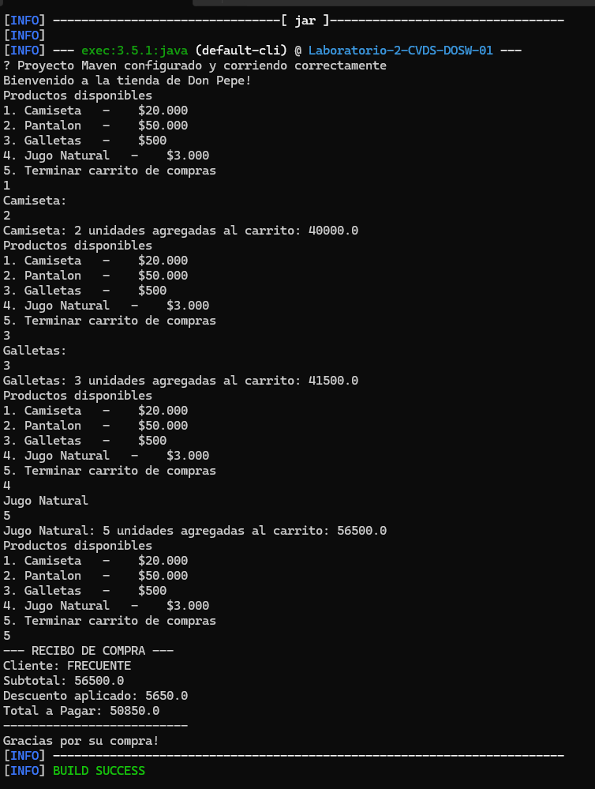

### Explicación

- Para la solución de este ejercicio se aplicaron los principios SOLID, especificamente la S, ya que una clase debería tener una unica responsabilidad esto se evidencia en la clase carrito de compras que dependiendo el tipo de cliente calcula el descuento, por otra parte la O en caso de que hayan más productos se puede seguir extendiendo con el fin de que sea escalable y por último la L ya que cada subclase puede ser sustituible por su respectiva superclase.

**Evidencia**

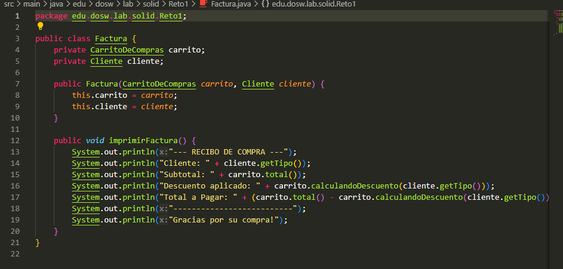

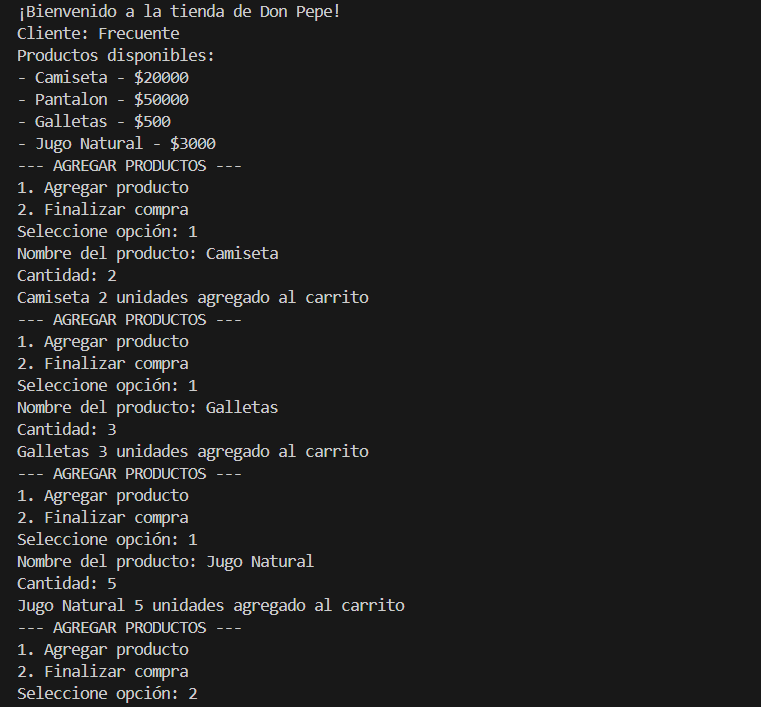

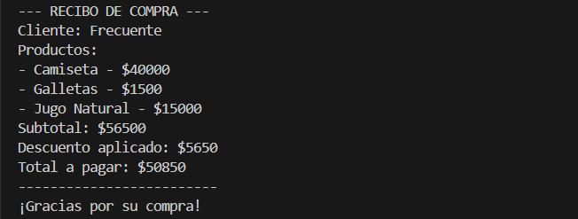

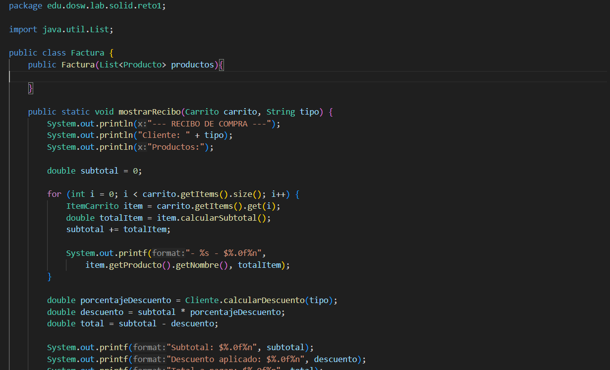

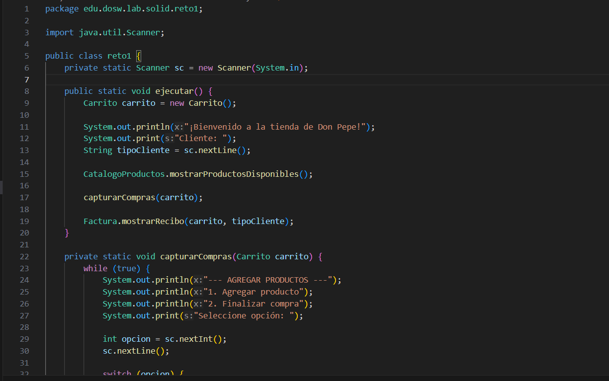

---

## Reto 2 Culminado:

**Evidencia**

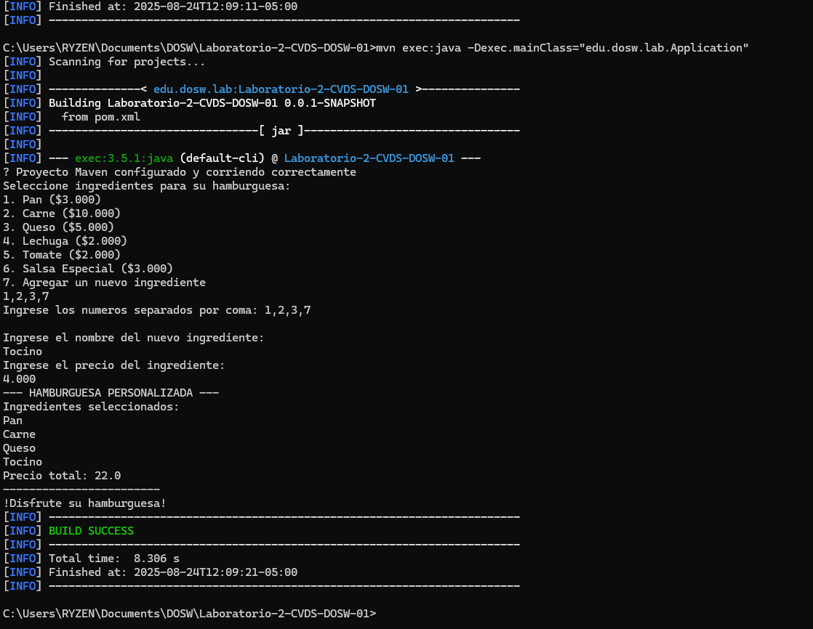

## Explicacion:

- Patrón de Diseño: Para la solución de este ejercicio se uso un patrón creacional

- Patrón Utilizado: Se empleo Builder

- Justificación: El patrón builder permite construir objetos complejos paso a paso, evitando tener constructores telescopicos, es decir, que tengan muchos parámetros.

- Como lo aplico: El patrón builder esta implementando mediante una interfaz (builder) todos los métodos para construir un objeto, una clase hamburguesaBuilder que implementa la interfaz para obtener el objeto esperado en este caso HamburguesaNuevoIngrediente.

**Evidencia**

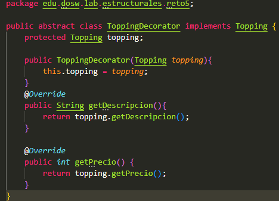

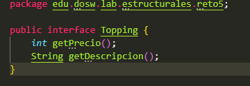

---

### Reto 3 Culminado:

**Evidencia**

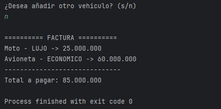

- Patrón de Diseño: Para este punto decidimos hacer uso de un patrón creacional

- Patrón Utilizado y su aplicacion: Usamos el patrón de Factory method, ya que los vehiculos dependían de dos variables como lo eran el tipo del vehiculo, como la categoría, gracias a este patrón nos ahorramos tener un codigo lleno de ifs, verificando cada una de estas variables, todo gracias a las clases Factory que implementamos
  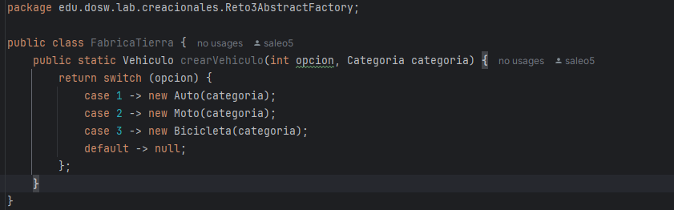
  tambien, para evitar tantas verificaciones, utilizamos el switch en varias ocaciones, se evidencia en las fabricas, y tambien en las categorias, que definimos como enumeracion, ya que habían solo 3 tipos ya definidos, que no iban a cambiar.

---

### Reto 4 Culminado:

**Evidencia**

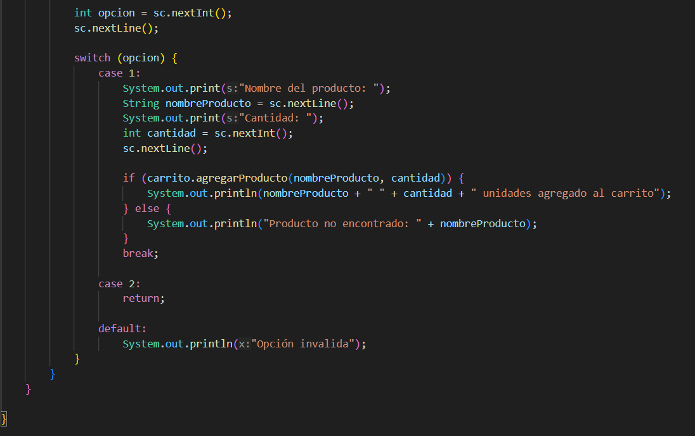

### Explicacion:

- Patrón de Diseño: Para la solución de este ejercicio se uso un patron de comportamiento.

- Patrón Utilizado: Se empleo Strategy - Adapter.

- Justificación: Strategy permite definir un tipo de logica diferente (algoritmos), colocar cada uno de ellos en una clase separada, como podria ser las diferentes opciones para realizar una tasa de cambio real.

- Como lo aplico: Para la aplicación de este patrón mediante una clase "Contexto" se puede organizar la respectiva tarea hacer, en este caso seria calcular la tasa real hacia la moneda destino mediante la instancia de la interfaz (Agregación) este metodo va a ser implementado en cada tipo de tasa destino donde hacemos la respectiva operación.

**Evidencia**

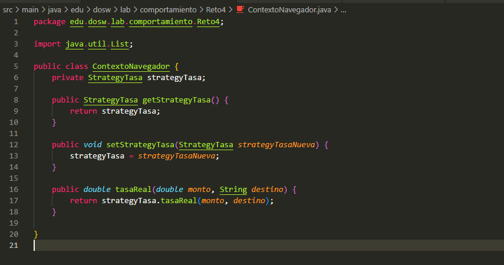

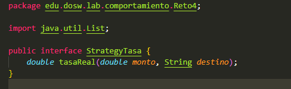

**Ejemplo de aplicación en alguna tasa especifica**

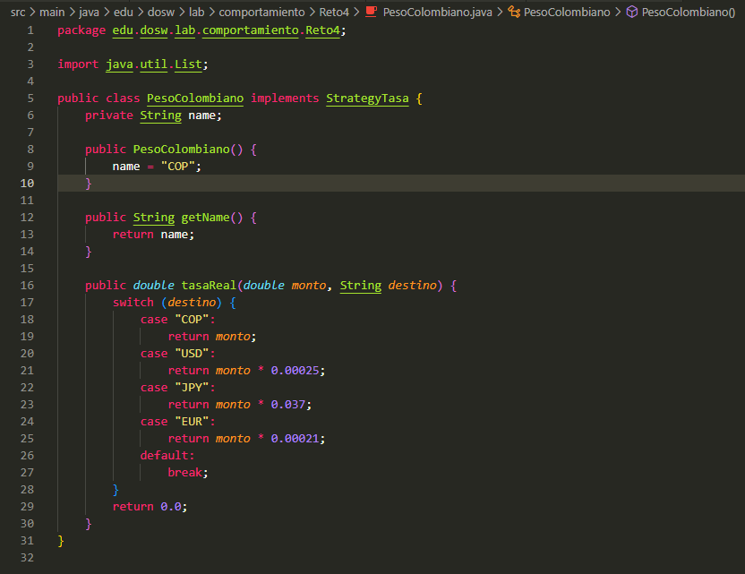

---

### Reto 5 Culminado:

**Evidencia**

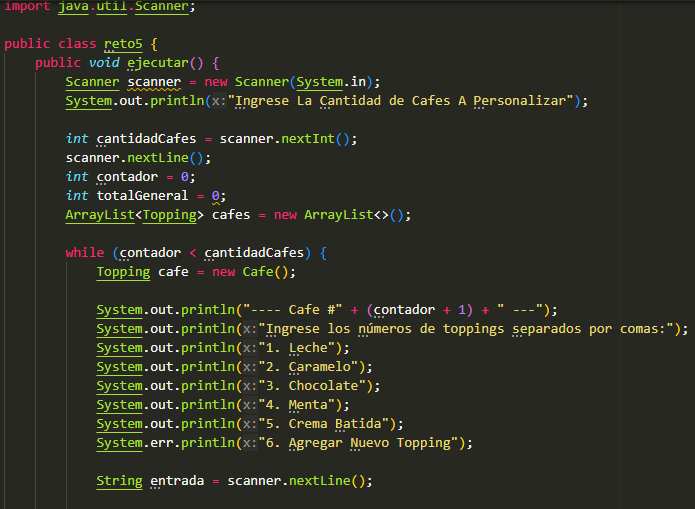

### Explicacion:

- Patrón de Diseño: Para la solución del reto se uso un patrón estructural

- Patrón Utilizado: Se empleo el patrón Decorator.

- El patrón decorator te permite añadir funcionalidades a objetos colocandos especies de encapsuladores que contienen estas nuevas funcionalidades.

- Para aplicar este patrón necesitmos generalizar una interfaz que tenga los métodos que vayan a compartir todos los objetos en este caso se llama Topping con los métodos getPrecio() y getNombre(), luego generalizamos un decorator base que va implementar esta interfaz y va a realizar los llamados correspondientes, a partir de esto añadimos los toppings: cafe, leche, chocolate pero heredando del decorator base y solamente sobreescribiendo sus métodos correspondientes.

**Evidencia**

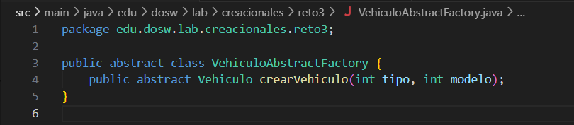

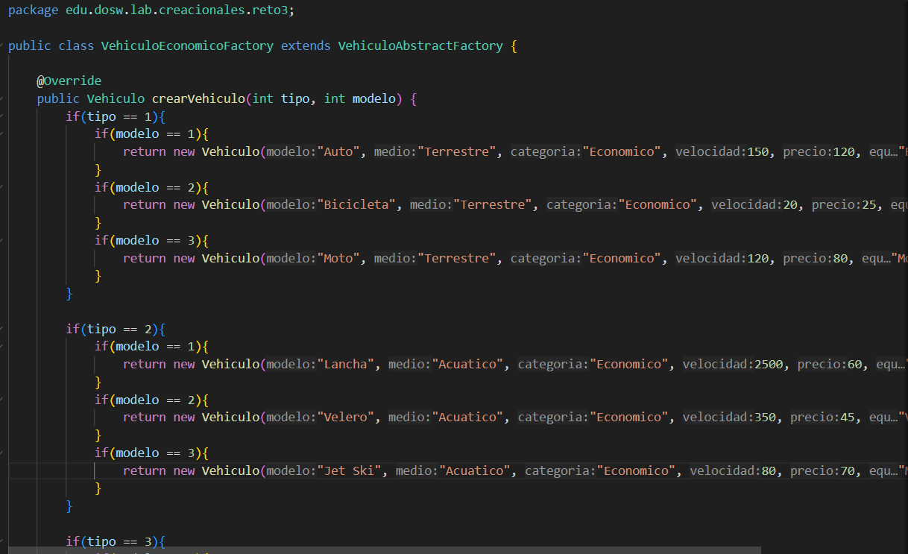

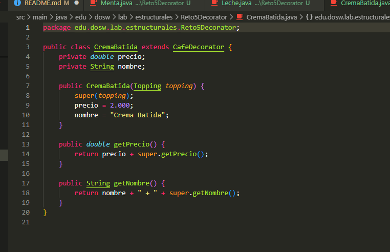

---

### Reto 6 Completado:

**Evidencia**
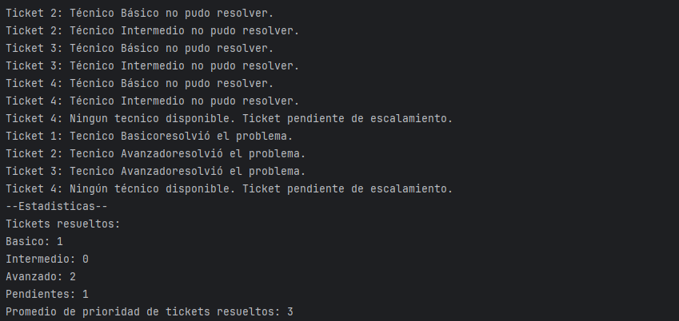
**Explicacion:**

- Patrón de Diseño: Comportamiento
- Patrón Usado: Cadena de responsabilidad
- Por que?: porque permite que cada tecnico decida si puede o no resolver el ticket según su nivel y prioridad; si no puede, transmite el ticket al siguiente técnico en la cadena, ademas de proporcionar una forma facil de extender el codigo, si quisieramos agregar otro tecnico por ejemplo
- Como se aplico:
  creamos clase abstracta soportteHandler 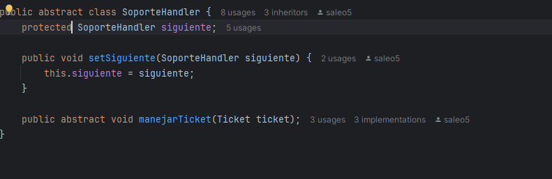 y con esto, pudimos definir en cada uno de los tipos de tecnicos, el como manejar los tickets, y saber si los podían resolver o no, como muestra: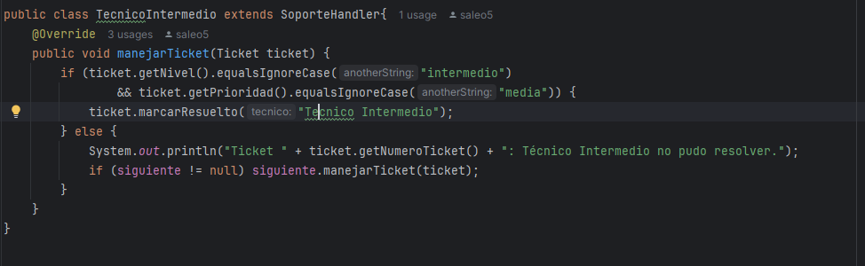 aqui podemos ver como manejamos los niveles y las prioridades, para ver si podían resolverlo, o si se lo pasaban al siguiente, y por ultimo, iniciamos el metodo de pasar a siguiente:

---

### Reto 7 Completado:

**Evidencia**

**Explicacion:**

- Patron de diseño: Patron de comportamiento
- Patron utilizado: command pattern
- Justificacion: Lo usamos, debido a que para solucionar este reto, vimos que cada accion del control remoto se comportaba como un comando, se podia ejecutar o no, y se debia registrar al historial para la salida
- como se aplico: definimos una interfaz con los metodos a usar por las demas clases 
  y en cada uno de los diferentes comandos, o acciones como los llamamos, usamos de distintas formas el como queriamos que actuara, teniendo siempre la opcion de que se ejecuten o no 

---

### Reto 8: Culminado

**Diagrama de Clases**

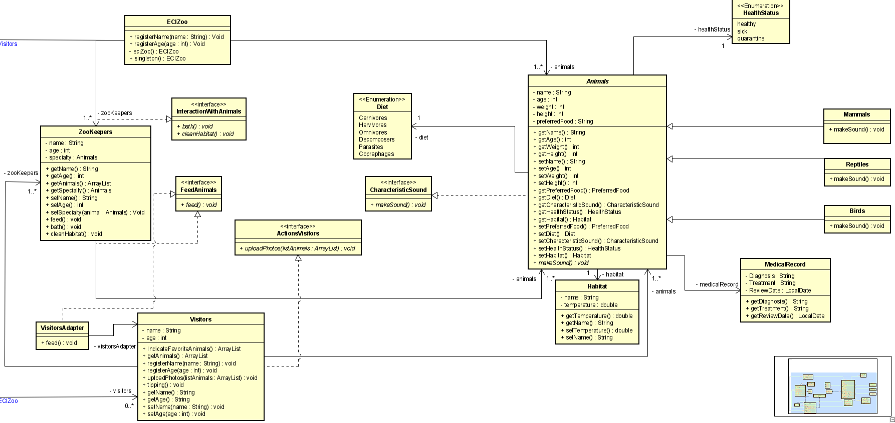

### Explicación:

**Clases Principales**

- Las clases que se crearon fueron ECIZoo, Animals, Visitors, ZOOKeepers

La clase Animals cuenta con atributos como name, age, weight, height y preferredFood. Además, posee otros elementos que pueden representarse como clases o enumeraciones, tales como MedicalRecord, Habitat, Diet y HealthStatus.

El atributo relacionado con el sonido característico de cada animal se maneja mediante una interfaz, ya que cada especie emite sonidos diferentes.

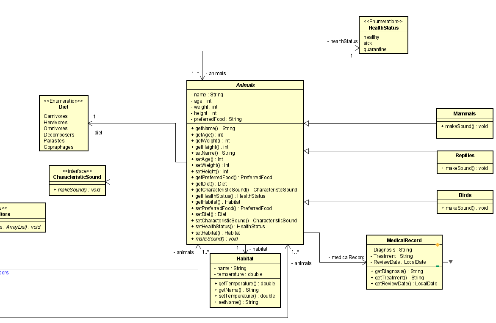

Por su parte, los Visitors están asociados a los Zookeepers y a los Animals, lo que les permite realizar acciones como dar propinas a los cuidadores, seleccionar animales favoritos y subir fotografías de ellos.

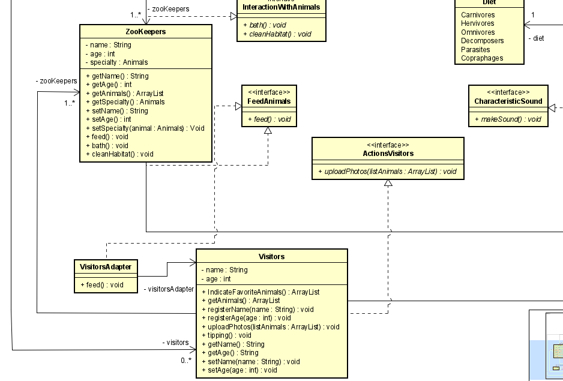

Los Zookeepers son responsables de las actividades diarias del zoológico, entre ellas bañar a los animales y limpiar los hábitats. Su especialidad puede determinarse a partir de la relación con los animales, ya que se enfocan en un tipo particular (mamíferos, aves o reptiles).

Finalmente, la clase ECIZoo se encarga de registrar a los visitantes (almacenando su nombre y edad) y mantiene relaciones directas con las clases principales: Animals, Zookeepers y Visitors.

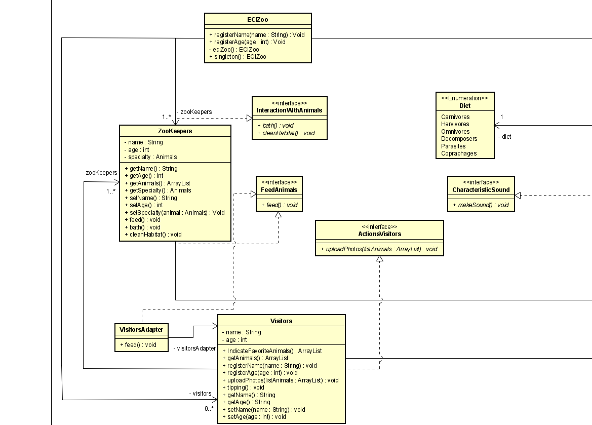

**Patrones Utilizados Y Principios SOLID:**

Los patrones implementados para el diagramas de clases fueron Adapter y Singleton.

Inicialmente se puede implementar el patrón Singleton en la clase ECIZOO, ya que solo queremos una instancia de este objeto, de igual manera en esta clase estamos aplicando el principio S ya que le estamos asignando su respectiva responsabilidad como podria ser registrar el nombre y edad de los visitantes.

El patrón Adapter se implemento con las actividades que pueden llegar a compartir los cuidadores y los visitantes especificamente en la función de alimentar ya que cada una de estas clases lo hacen de manera independiente por lo que podemos crear una clase llamada AdapterBath que tiene el metodo y luego en visitors este la implementa.

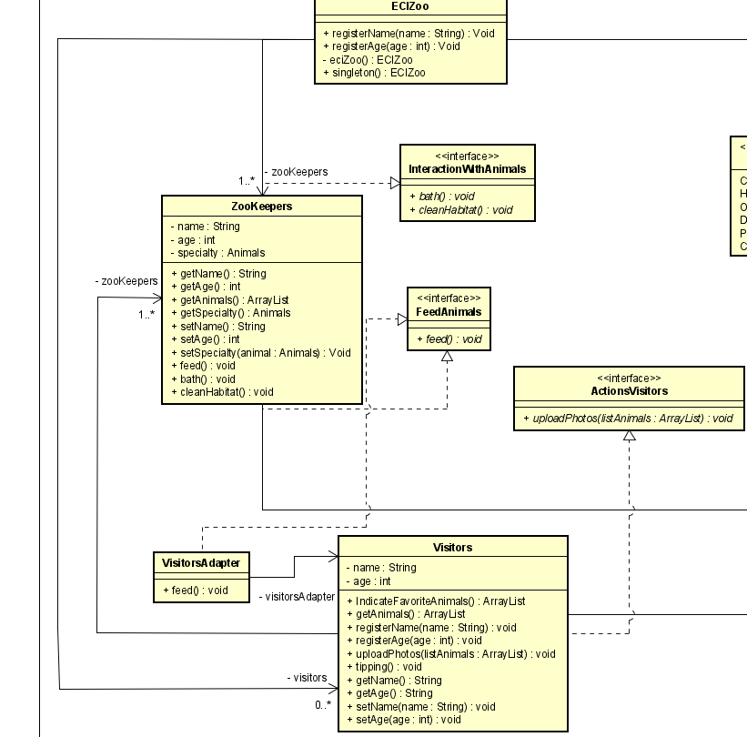

Con respecto a las demas letras de SOLID, se ve la O en el apartado de Animals ya que si quisieramos añadir nuevos tipos de animales seria posible sin necesidad de modificar la superclase Animals de igual forma se observa el principio L para esto.

El principio siguiente I lo podemos observar repetidamente en el diagrama ya que hay varias clases que implementan interfaces especificas.

---
