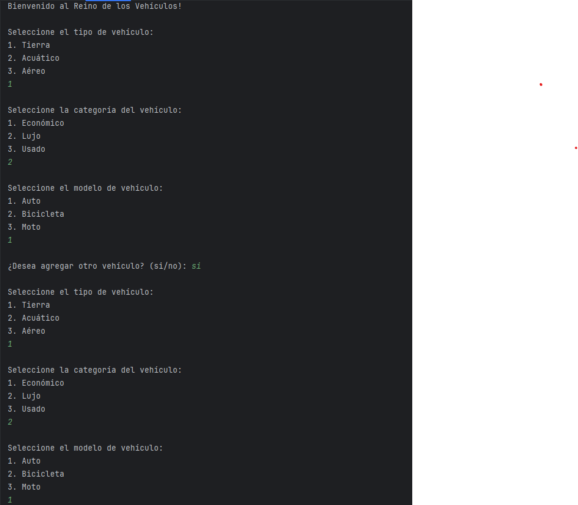
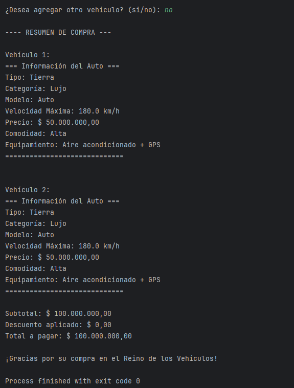
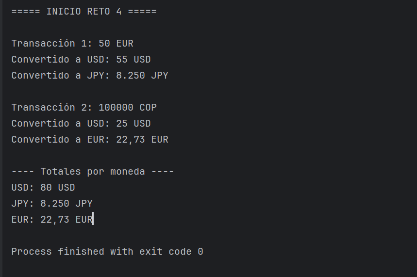
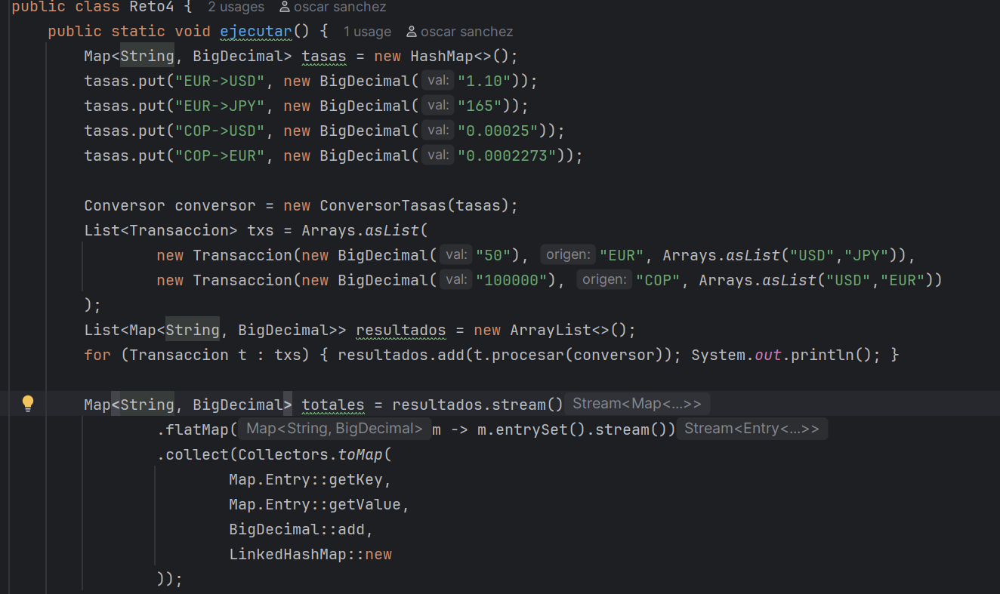
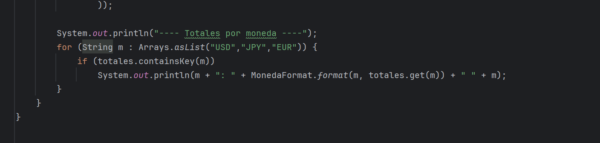
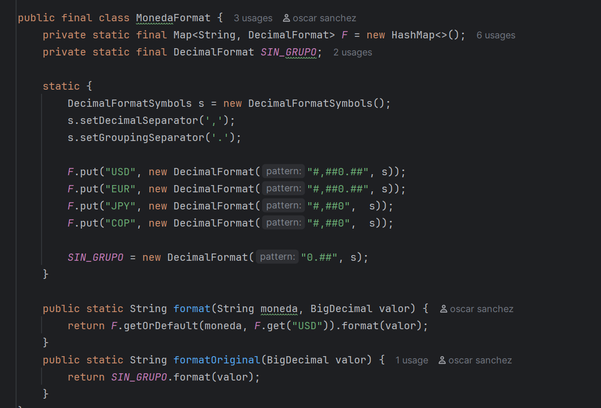
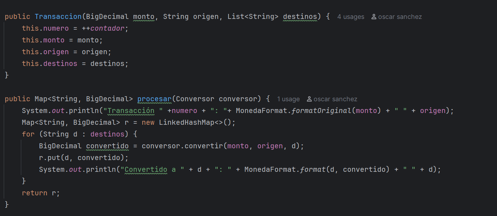
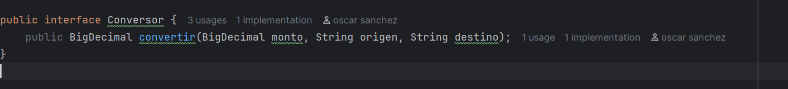
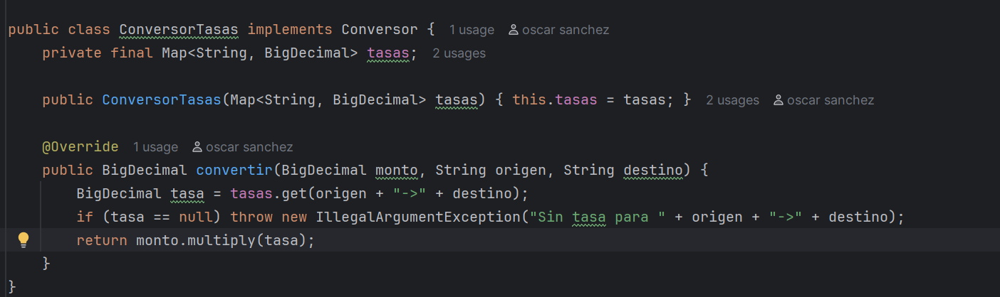
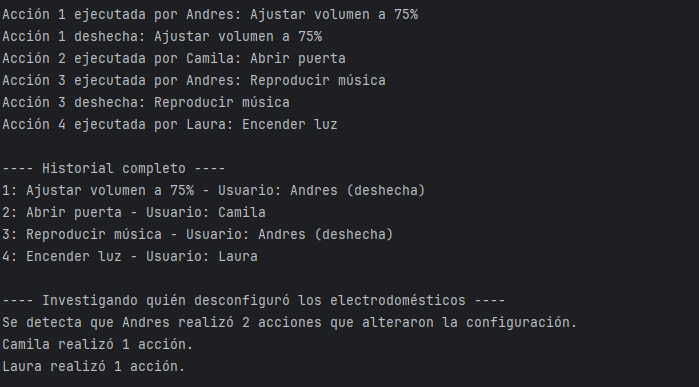

# Laboratorio-2-CVDS-DOSW-01
# 📝 Laboratorio 02 – SOLID, Patrones de Diseño y UML

**Integrantes:**
- Oscar Sanchez
- Julian Ramirez
- Valeria Bermudez

**Nombre de la rama:**
`feature/SanchezOscar_RamirezJulian_BermudezValeria`

✅ Retos Completados
### Reto 1: El problema de la tienda de Don Pepe
**Evidencia:**

<h4>Descripción breve de lo que hicieron:  
</h4>
Se implementó un sistema sencillo de compras para la tienda de Don Pepe aplicando principios de SOLID. Creamos clases para representar productos (Producto), ítems en el carrito (ItemCarrito) y el carrito de compras (CarritodeCompras). Se definieron tipos de clientes (ClienteNuevo, ClienteFrecuente) que aplican distintos tipos de descuentos mediante el tipo de cliente (DescuentoNu, DescuentoFe). Además, se creó la interfaz Irecibo y su implementación Imrecibo para generar un recibo con detalle de productos, subtotal, descuento aplicado y total a pagar.

### Reto 3: El Reino de los Vehículos
**Evidencia:**

<h4>Descripción breve de lo que hicieron:  
</h4>

Nuestro grupo desarrolló un sistema en Java aplicando el patrón Factory Method para la creación de vehículos de tierra, acuáticos y aéreos.

Se implementó una clase abstracta Vehiculo y subclases como Auto, Moto, Bicicleta, Lancha, Velero, Avion, Avioneta, entre otras. La clase VehiculoFactory centraliza la creación de los objetos según las elecciones del usuario.

El sistema cuenta con un menú interactivo en consola donde el usuario selecciona el tipo, categoría y modelo de vehículo, y finalmente se genera un resumen de compra en pesos colombianos, mostrando precios, características y el total a pagar.

---
### Reto 4: La Estafa de la Casa de cambio
**Evidencia:**

<h4>Descripción breve de lo que hicieron:  
</h4>
En este código se usa polimorfismo para que las Transacciones trabajen con la interfaz Conversora sin importar qué implementación concreta se use, 
lo que permite invocar el mismo método con diferentes comportamientos. 
Además, se aplica el patrón Strategy, ya que la lógica de la conversión de monedas se encapsula en clases que se implementan en la Conversorcion (como ConversorTasas), 
y Transacciones delega en ellas el algoritmo de conversión, permitiendo cambiar fácilmente la estrategia sin modificar la clase principal.
---

### Reto 7: El control remoto
**Evidencia:**

<h4>Descripción breve de lo que hicieron:  
</h4>
En este reto implementamos un control remoto mágico que permite ejecutar y deshacer acciones sobre diferentes dispositivos del hogar como luces, puertas, música y volumen. 
Para la solución utilizamos el patrón de diseño Command, ya que nos permitió encapsular cada acción en una clase independiente y mantener un historial de lo que se ejecutó y quién lo hizo.

Durante el desarrollo, cada integrante del grupo aportó en diferentes partes: 
algunos trabajaron en la definición de los comandos y receptores, otros en la lógica del historial y el análisis de los usuarios, y finalmente se integró todo en el programa principal.
Al final, el sistema permite registrar acciones con parámetros, deshacerlas cuando sea necesario y mostrar un resumen completo con los responsables de cada cambio.