# Laboratorio 02 - SOLID, Patrones de Diseño y UML

**Integrantes**
- Julián David Castiblanco Real
- David Santiago Palacios Pinzón
- Robinson Steven Nuñez

**feature/PalaciosDavid_CastiblancoJulian_NuñezRobinson_2025-2**

---

## ✅ Retos Completados

### RETO #1: El problema de la tienda de Don Pepe

Evidencia:

Descripción:
Debemos ayudar a Don Pepe ya que no tiene un sistema organizado para manejar sus ventas,
asi que se creo un sistema con los pricipios de solid, como s para que cada clase tuviera
su única responsabilidad, tambien la d para los clientes.

### RETO #3: El Reino de los Vehículos
Evidencia:

📝 Entrada:

📢 Salida:

Descripción:
Una concesionaria llamada el Reino de los vehículos vende todos los medios de transporte que se imaginen, desde vehículos de tierra , vehículos acuáticos y vehículos aéreos, cada uno con categorías como Económico, Lujo y Usado.
Cada categoría afecta las características de los vehículos como su velocidad máxima, comodidad, precio y equipamiento.
Los vehículos disponibles para los compradores son Autos, Bicicletas, Motos, Lanchas, Veleros, Jet Skis, Aviones, Avionetas y Helicópteros.

**Patrón de diseño:**

- ***Patrón de diseño:*** Creacional
- ***Patrón utilizado:*** Abstract Factory
- ***Justificación:*** Implementamos un patrón de fábrica abstracta para la creación de vehículos.
Esto nos permite instanciar diferentes tipos de vehículos (autos, motos, bicicletas, lanchas, veleros, jet skis, aviones, avionetas y helicópteros) de forma desacoplada y extensible.
Gracias a este patrón, se pueden agregar nuevos vehículos o categorías sin necesidad de modificar la lógica central del sistema, cumpliendo con el principio abierto/cerrado (OCP) de SOLID.

- ***Cómo lo aplicamos:*** Definimos una interfaz común Vehicle con métodos para obtener tipo, categoría, velocidad máxima, precio y equipamiento.
Cada vehículo (ej. Car, Bike, Boat, Plane) implementa esa interfaz.
Mediante la clase GeneralFactory, el sistema crea los objetos de manera dinámica dependiendo de la elección del usuario (tipo y categoría), y al final se generan los recibos usando streams para calcular el total.

### RETO #6: Habla con Soporte Técnico
Evidencia:

📝 Entrada:

📢 Salida:

Descripción:
Cada ticket tiene un nivel de complejidad el basico, intermedio o avanzado y una prioridad baja media o alta.
Los técnicos tambien se clasificion en basico, intermedio o avanzado intentan resolver cada ticket en orden, pero si ninguno puede resolverlo,
el ticket queda pendiente de escalamiento y para eso usamos streams para generar las carateristicas.

**Patrón de diseño:**

- ***Patrón de diseño:*** De comportamiento
- ***Patrón utilizado:*** Chain of Responsibility
- ***Justificación:*** Implementamos un patrón de diseño de cadena de responsabilidad para el procesamiento de tickets.
  Esto permite que una solicitud sea evaluada secuencialmente por múltiples tecnicos hasta que uno la procesa.
  Si ningún tecnico puede hacerse cargo, el ticket llega al final de la cadena y se marca para su escalada.

- ***Como lo aplicamos:*** Cuando un ticket se procesa, se invoca el método handleTicket(). Este verifica si el técnico actual puede resolverlo.
  Si es así, se marca el ticket como resuelto y se guarda el nivel del técnico que lo atendió. Si no puede resolverlo,
  el ticket se envía automáticamente al siguiente técnico de la cadena. Finalmente, si ningún técnico logra atenderlo,
  se marca el ticket como pendiente de escalamiento.

### RETO #7: El control remoto Mágico

Evidencia:

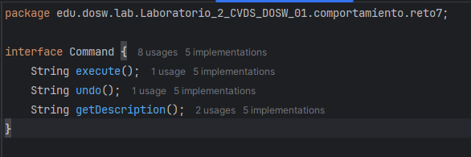
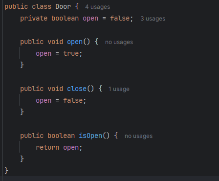
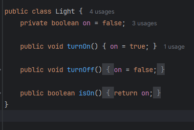
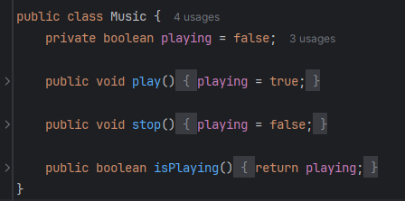
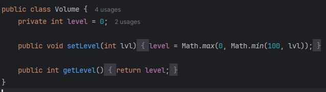
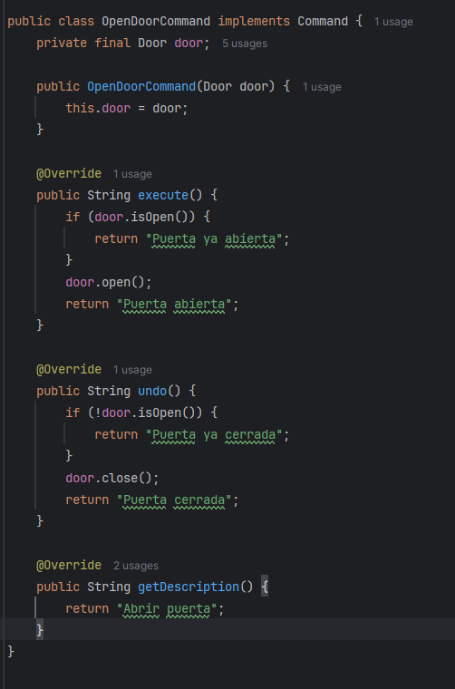
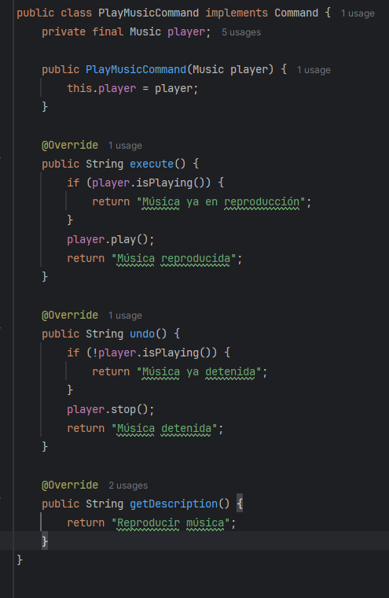
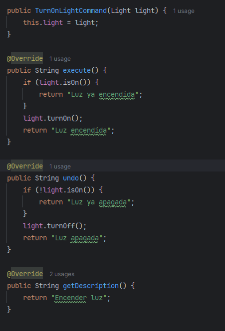
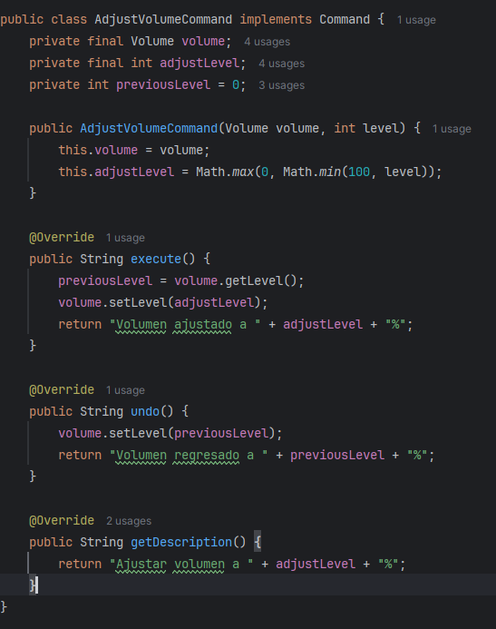
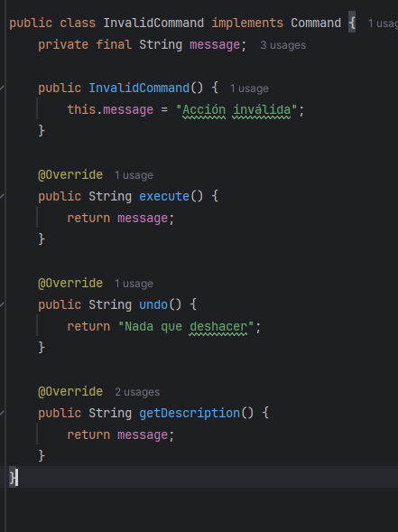
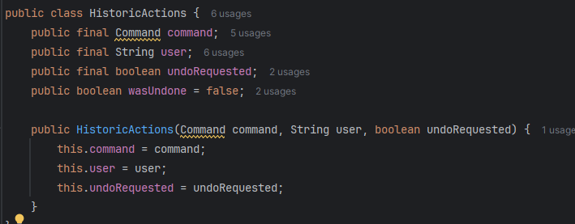
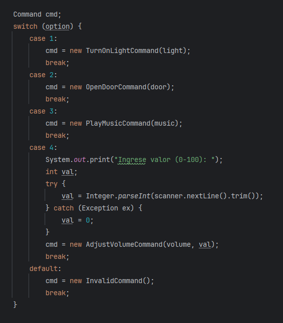

📝 Entrada:

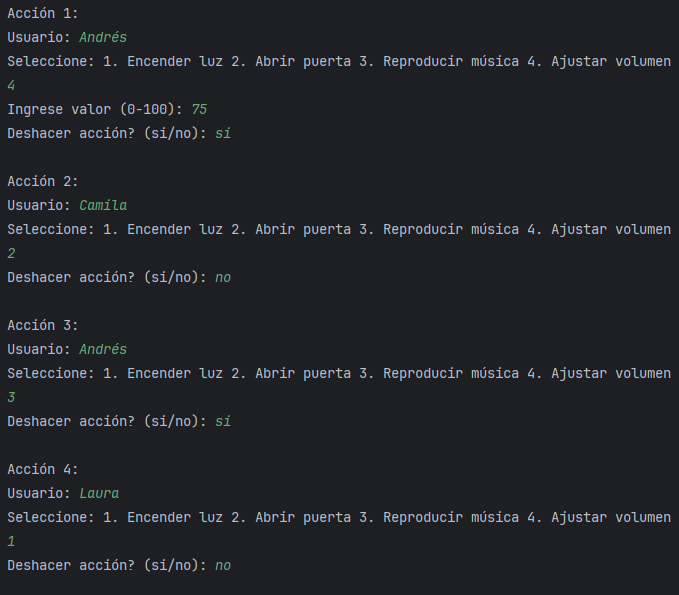

📢 Salida:

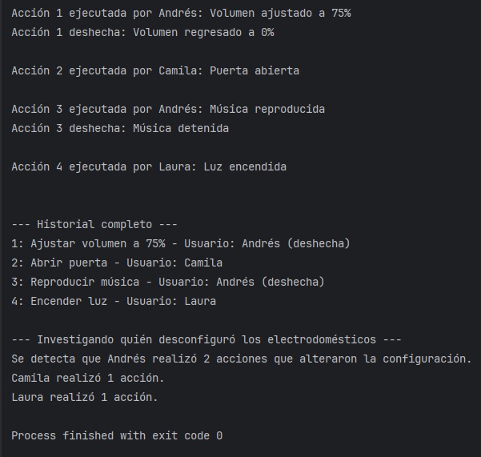

Descripción: 
Lo que se hizo fue encapsular las distintas acciones que se hacen con el control 
entonces se registraron en un historial,

**Patrón de diseño:**

- ***Patrón de diseño:*** De comportamiento
- ***Patrón utilizado:*** Command
- ***Justificación:*** Convierte cada acción en un objeto, separando claramente quién pide la acción de quién la ejecuta, asi se facilita
  que se pueda deshacer ya que cada comando guarda una especie de historial que guarda el estado anterior necesario para revertir la operación,
  asi facilmente se agregan nuevas funcionalidades, cumpliendo el principio de open/closed.

- ***Como lo aplico:***
  Por medio de una interfaz Command que actúa como contrato común, las distintas acciones se implementan como objetos que exponen métodos para ejecutar,
  deshacer y describirse (registro). De este modo las clases concretas quedan contenidas en un archivo y cada una encapsula los parámetros necesarios para realizar su función y,
  cuando hace falta, guarda el estado previo para poder restaurarlo al deshacer.
  La clase invocadora crea los comandos, llama a execute() y, si corresponde, a undo(), y además almacena un ActionRecord
  por cada petición para mantener el historial y poder investigar quién realizó cada cambio.

### RETO #8: El Zoológico de los UML

Nos acaban de contratar para hacer una app llamada ECI Zoo en la que vamos a gestionar los animales, cuidadores y visitantes,
para elló, tomamos los animales y los gestionamos con atributos estáticos y dinámicos.
Modelamos los cuidadores, sus especialidades y sus interacciones (alimentar, bañar, limpiar hábitat).
Modelamos los visitantes que pueden marcar favoritos, alimentar animales, dar propinas y subir fotografías.
Para darle solución usamos principios de diseño SOLID y patrones cuando correspondia.

**Diagrama de Clases:**
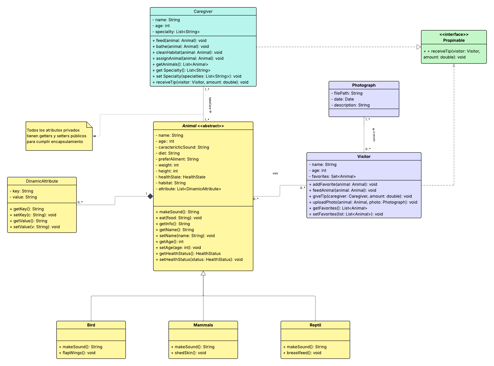

***Evidendia de realización en Lucidchart:***
https://lucid.app/lucidchart/47a13a4b-f336-4fa6-9a75-147ec7fe6ca7/edit?viewport_loc=-2429%2C-1585%2C5646%2C2537%2C0_0&invitationId=inv_41ec6382-579a-4ae1-9f06-aa9cafa1f7ce

***Clases principales:***
- Animal, Caregiver, Visitor, Phograph, Propinable y DynamicAttribute

***Asociaciones y multiplicidades:***
- Un animal puede tener 1..* cuidadores o un cuidador puede tener 1..* animales que cuidar.
- Un visitante puede tener varios favoritos, y un animal puede ser favorito de muchos visitantes.
- Cada foto siempre tiene un visitante asociado, y un visitante puede subir múltiples fotos.
- Cada animal puede tener múltiples atributos dinámicos como pelaje, rareza o historial médico
- Modelamos que un visitante puede dar propinas o interactuar con varios cuidadores y viceversa. La interacción concreta de dar propina se modela mediante la interfaz Propinable

***Aplicación de SOLID***

- Single Responsibility Principle: Cada clase cumple una sola responsabilidad: Animal el comportamiento de animales; Cuidador acciones sobre animales; Visitor interatua con el zoo; DynamicAttribute solo maneja atributos dinámicos y Propinable se encarga de las propinas
- Open/Closed Principle: La clase Animal esta abierta a extención ya que añade nuevas subclases y Propinable permite nuevos receptores de propinas sin modificar Visitor.
- Liskov Substitution Principle: Las subclases de Animal deben comportarse como Animal, y cada una tiene un método único
- Interface Segregation Principle: La interfaz Propinable es pequeña y específica ya que solo tiene un metodo estableciendo un contrato para que los visitantes que dan propina estén cómodos.
- Dependency Inversion Principle: Visitor es como un modulo de alto nivel que depende de la abstracción Propinable que es la interfaz, en lugar de depender de modulos de bajo nivel como lo es la clase de Caregiver por lo que el Caregiver es una implementación concreta de esa abstracción.

***Patrones de diseño usados***
- Abstract Factory: para creación de Animal según su tipo.
- Decorator: Nos sirvio para modelar DynamicAttribute si se desea añadir un nuevo comportamiento y encapsularlo.
- Observer: Para notificar cambios de healthStatus a cuidadores o a subsistemas

