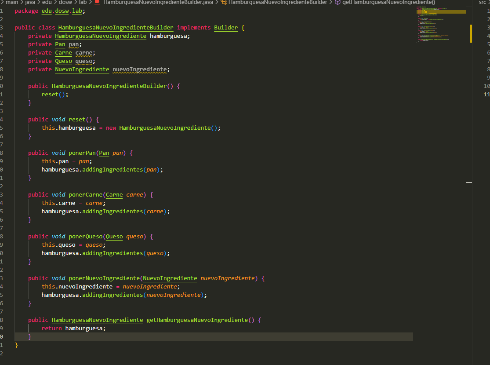

# 🧪 Laboratorio 02 - SOLID, Patrones de Diseño y UML

**Integrantes:**

- Tulio Riaño Sanchez
- Samuel Leonardo Albarracin

**Nombre de la rama:**
'feature/RianoTulio_SamuelAlbarracin_2025-2'

---

## ✅ Retos Completados

## Reto 1 Culminado:

**Evidencia**

---

## Reto 2 Culminado:

**Evidencia**

## Explicacion:

- Patrón de Diseño: Para la solución de este ejercicio se uso un patrón creacional

- Patrón Utilizado: Se empleo Builder

- Justificación: El patrón builder permite construir objetos complejos paso a paso, evitando tener constructores telescopicos, es decir, que tengan muchos parámetros.

- Como lo aplico: El patrón builder esta implementando mediante una interfaz (builder) todos los métodos para construir un objeto, una clase director que es quien orquesta que tipo de objetos crear y una clase respectiva que implementa la interfaz para obtener el objeto esperado en este caso HamburguesaNuevoIngrediente.

**Evidencia**

---
