# 📘 Laboratorio 2 - CVDS DOSW 01  

## 👥 Integrantes  
- **Raquel Selma**  
- **Néstor David López**  
- **Santiago Suárez**  

---

## 🌿 Rama de trabajo  
`feature/SuarezSantiago_SelmaRaquel_LopezNestor_2025-2`  

---
## 🔎 Reto 2

### Patrón utilizado: **Builder**
Para este reto se uso el patron **Builder** dado que la hamburguesa puede tener multiples elementos en su 
constructor(Ingredientes) y cada persona puede elegir una combinacion distinta entonces el patron **Builder**
nos permite hacer la hamburguesa paso a paso.

En nuestro caso:
- Tenemos la hamburguesa y una clase llamada HamburguesaBuilder
- Tenemos una clase abstracta **Ingrediente** donde cada ingrediente extiende esa clase
- Facilita la extensibilidad de ingredientes 

## 📊 Resultados
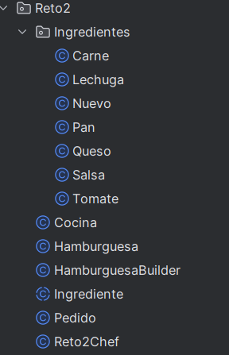
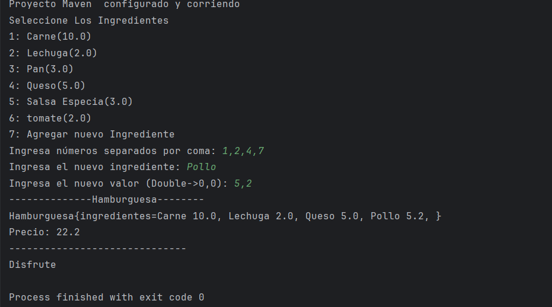

## 🔎 Reto 3
### Patrón utilizado: **Factory**
Para el reto 3 se utilizo el patron **Factory** popr que nos permite crear objetos de distintos tipos y categorias
Tenemos una clase abstracta vehiculo, y para cada vehiculo se creo una clase abstracta que la extienden las subclases
(economica, usado, lujo).

Aparte tenemos una interfaz llamda VehiculoFactory que tiene como metodos la creacion de cada vehiculo, luego tenemos clases concretas para cada
categoria, donde se sobrescriben esos metodos y se crea el vehiculo necesario

Para este caso:
- El patron nos ayuda a desacoplar la creacion de vehiculos
- Es extensible para nuevos tipos de vehiculos y subcategorias

## 📊 Resultados
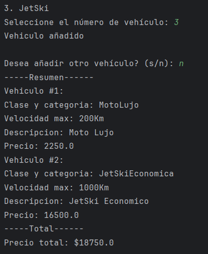
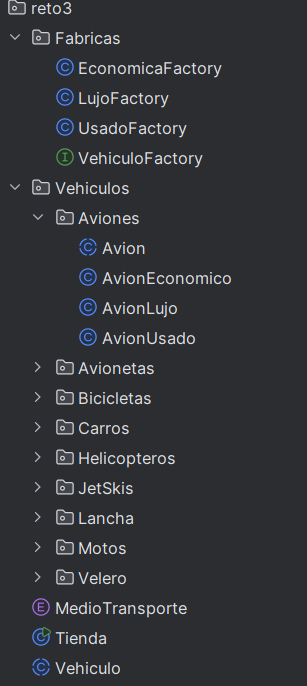
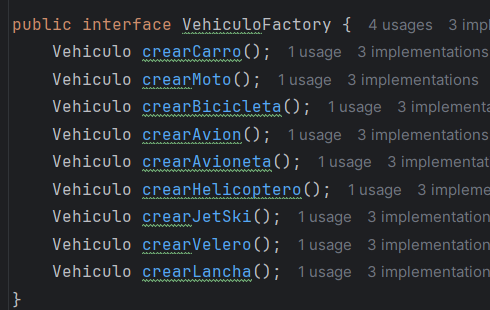
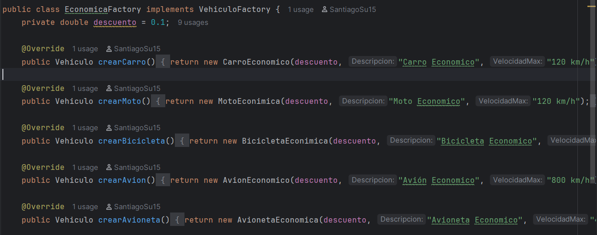

## 🔎 Reto 4

### Patrón utilizado: **Strategy**
Para este reto decidimos usar el patron **Strategy** ya que tenemos distintas etrategias 
para cada moneda.

Lo que se realizo fue que cada moneda (origen) se pase a USD y luego de USD a la moneda deseada
Hay una interfaz llamada **Moneda** Moneda, donde cada moneda (EUR,COP, USD, etc)
la implementa  y tienen su tasa de conversion de USD y aUSD

Este patron nos ayuda a poder poner mas monedas en el futuro.

## 📊 Resultados
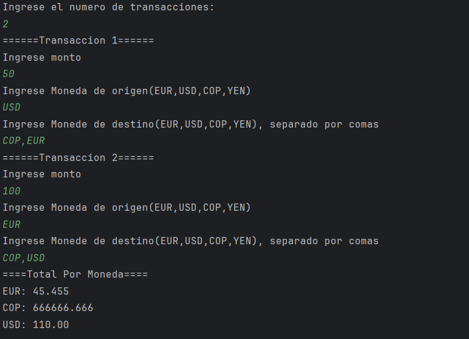
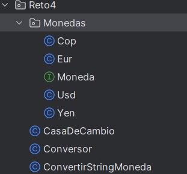
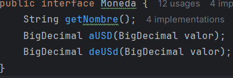
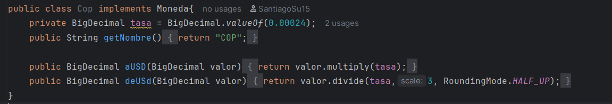
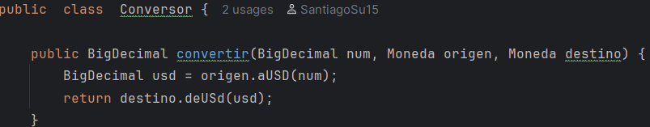

## 🔎 Reto 5  

### Patrón utilizado: **Decorator**  

Para este reto realizamos un análisis de los diferentes patrones de diseño, con el fin de determinar cuál era el más adecuado. Tras la revisión concluimos que el patrón **Decorator** era el más apropiado, ya que:  
- Es un **patrón estructural**.  
- Permite **añadir funcionalidades adicionales a los objetos** sin modificar su estructura base.  
- Facilita la **extensibilidad** y el **reuso de código**.  

En nuestro caso:  

- El **componente principal** es el **café**.  
- Creamos una **interfaz para los toppings**, que se implementa en una clase abstracta.  
- A partir de esta clase se heredan los diferentes tipos de **toppings** que pueden agregarse al café.  

---

## Evidencia trabajo en equipo 

**Nuestra compañera Raquel nos ayudo en presencia asi que ella no tiene commmits, ella nos ayudo en clase**
---

## 📊 Resultados  
A continuación, se muestran los resultados obtenidos:  
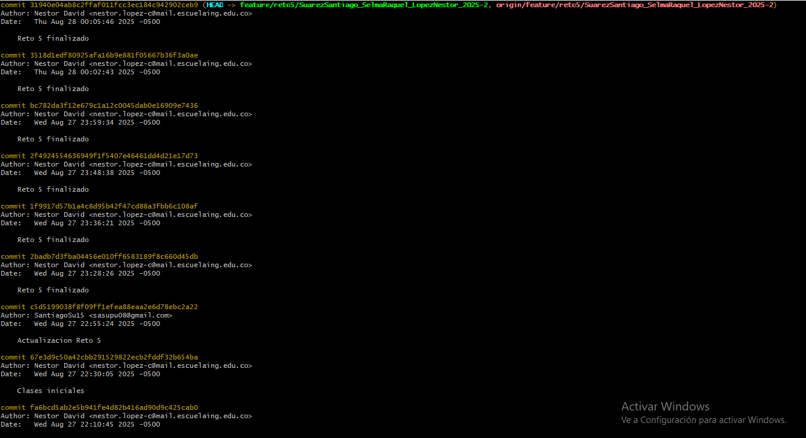

## 🔎 Reto 6

### Patron utilizado: Chain of Resposibility
Para este reto en un primer momento tratamos de analizar lo que es la prioridad del reto como tal, tras observalo durante casi una hora logramos identificar que quizas necesitaba un patron comportamental ya que el ejercicio era de que los objetos como lo son los tecnicos tienen su responsabilidad y dependiendo de eso saben que realiza que. Luego al ver mas a fondo los patrones encontramos el Chain of resposibility el cual consiste en pasar las solicitudes haciendo que cada uno decida si lo procesa o no lo hace. Esto es muy oportuno para nuestro ejercicio debido a que cada tecnico elije si puede o no hacer el trabajo por lo que decidimos aplicarlo.
Entonces para eso creamos la clase abstracta tecnico y de ahi salen los tecnicos basicos, intermedios y avanzados. Delegando la resposabilidad dependiendo del nivel del trabajo. Sin embargo tuvimos un problema y es que al ver la salida no entendiamos por que el intermedio no podia resolver su problema y tampoco entendimos por que el basico no podia atender con el ultimo pedido asi que al no entender no pudimos aplicarlo y lo dejamos de tal manera que dependiendo del nivel que tenga los tecnicos van a ver si lo pueden resolver o no.
Asi que nos dio como resultado:

## 🔎 Reto 7
### Patron utilizado: Command
Para este ejercicio decidimos utilizar el patron Command ya que este patron nos permite encapsular las acciones que vamos a realizar ya sea encender las luces o subir el volumen como objetos independientes, esto facilita el registro del historial y los registros de quien ejecuto que. Tambien es util para ver quien deshace que accion.
Resolviendo este ejercicio decidimos primero crear una interfaz que se llame comando, esta intefaz va a tener los primeros metodos que luego los vamos a implementar en los comando mas especificos.Luego se crean los respectivos objetos de luz,puerta,reproductor musica y ahi tendremos los respectivos metodos con lo que puede realizar cada clase. Finalmente creamos la clase main que es la denominada reto7.

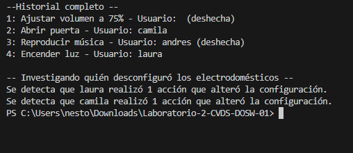