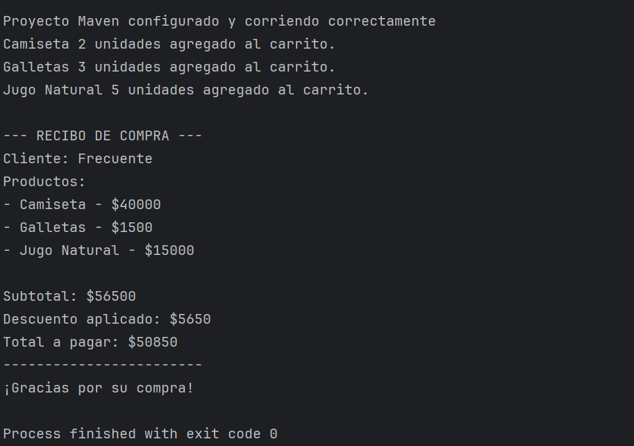
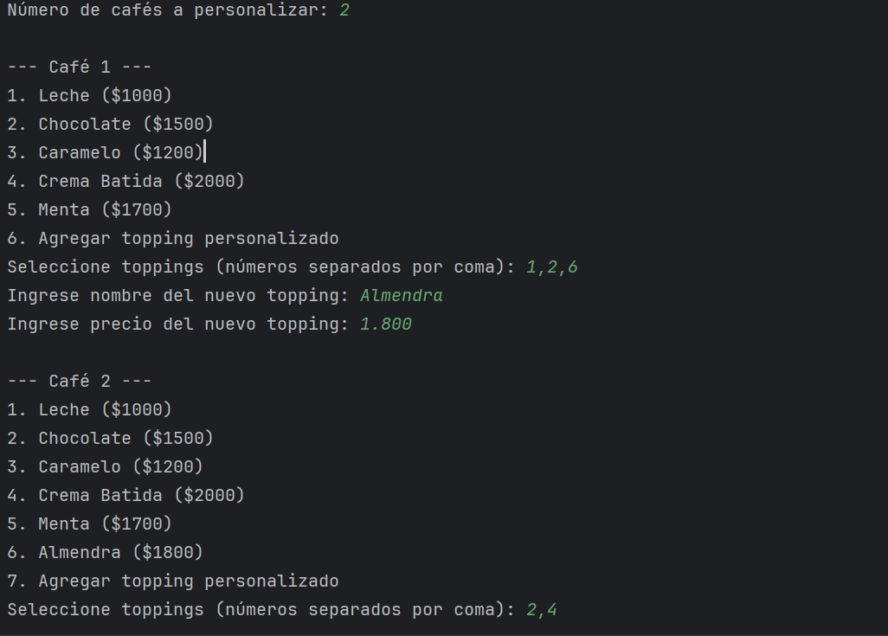
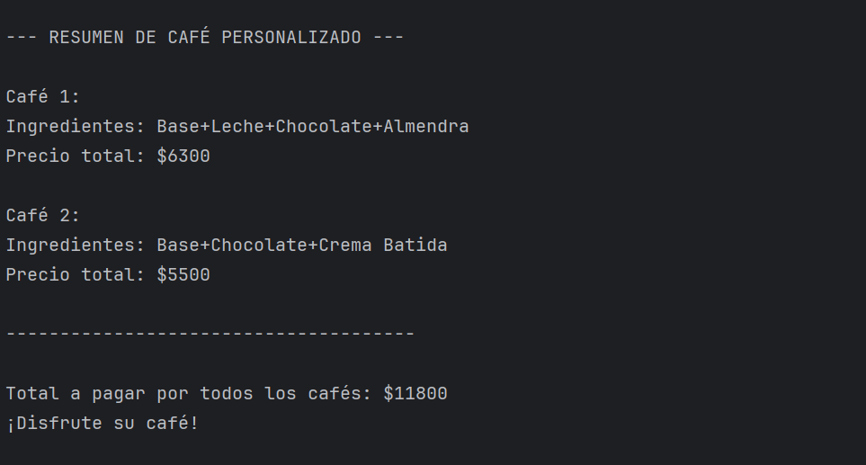
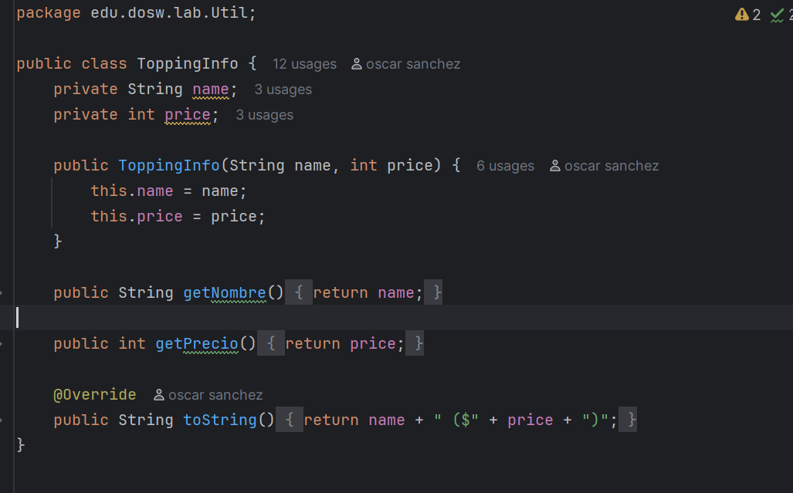
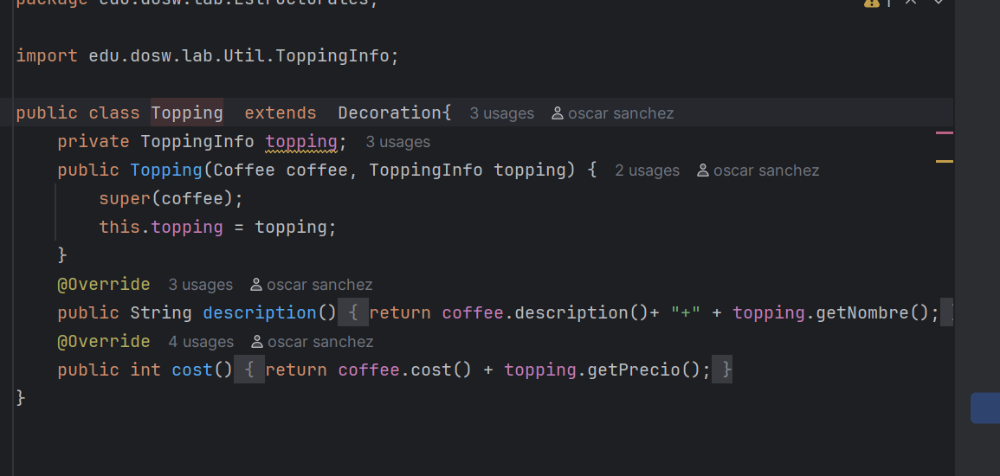
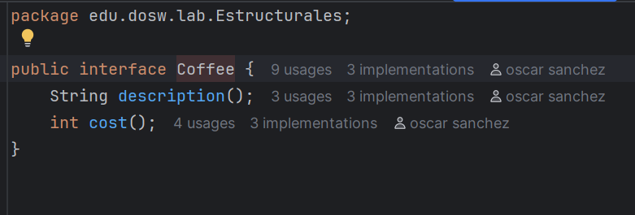
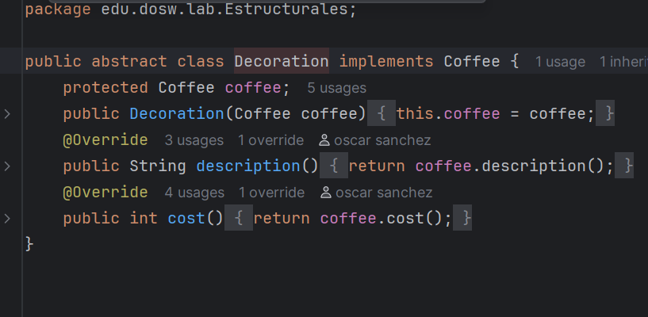
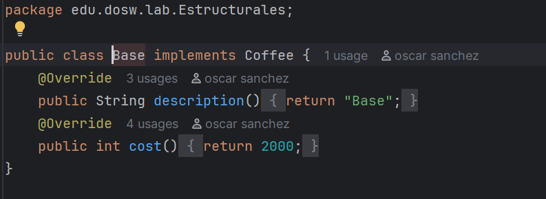

# Laboratorio-2-CVDS-DOSW-01
# 📝 Laboratorio 02 – SOLID, Patrones de Diseño y UML

**Integrantes:**
- Oscar Sanchez
- Julian Ramirez
- Valeria Bermudez

**Nombre de la rama:**
`feature/SanchezOscar_RamirezJulian_BermudezValeria`

✅ Retos Completados
### Reto 1: El problema de la tienda de Don Pepe
**Evidencia:**

<h4>Descripción breve de lo que hicieron:  
</h4>
Se implementó un sistema sencillo de compras para la tienda de Don Pepe aplicando principios de SOLID. Creamos clases para representar productos (Producto), ítems en el carrito (ItemCarrito) y el carrito de compras (CarritodeCompras). Se definieron tipos de clientes (ClienteNuevo, ClienteFrecuente) que aplican distintos tipos de descuentos mediante el tipo de cliente (DescuentoNu, DescuentoFe). Además, se creó la interfaz Irecibo y su implementación Imrecibo para generar un recibo con detalle de productos, subtotal, descuento aplicado y total a pagar.

---
### Reto 5: La Estafa de la Casa de cambio
**Evidencia:**

<h4>Descripción breve de lo que hicieron:  
</h4>
- Patrón de Diseño: Decorator (Patrón Decorador)  
- Patrón Utilizado: Decorator permite añadir funcionalidades adicionales a un objeto de manera dinámica sin modificar su clase base.
- Justificación: Se utiliza para personalizar cafés con distintos toppings sin crear subclases para cada combinación posible. Esto hace que el sistema sea más flexible y escalable.
- Como Lo aplico responde esto:
  - La clase Base representa el café base. 
  - La clase abstracta Decoration implementa la interfaz Coffee y mantiene una referencia al café que decora. 
  - La clase Topping extiende Decoration y añade un topping específico, modificando la descripción y el costo del café. 
  - ToppingFactory gestiona la creación de toppings y permite agregar toppings personalizados dinámicamente. 
  - En Reto5, se aplican los toppings sobre cada café usando el patrón decorador, combinando múltiples toppings de manera dinámica.

---
