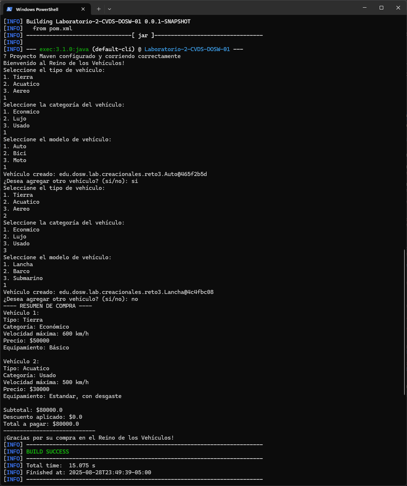
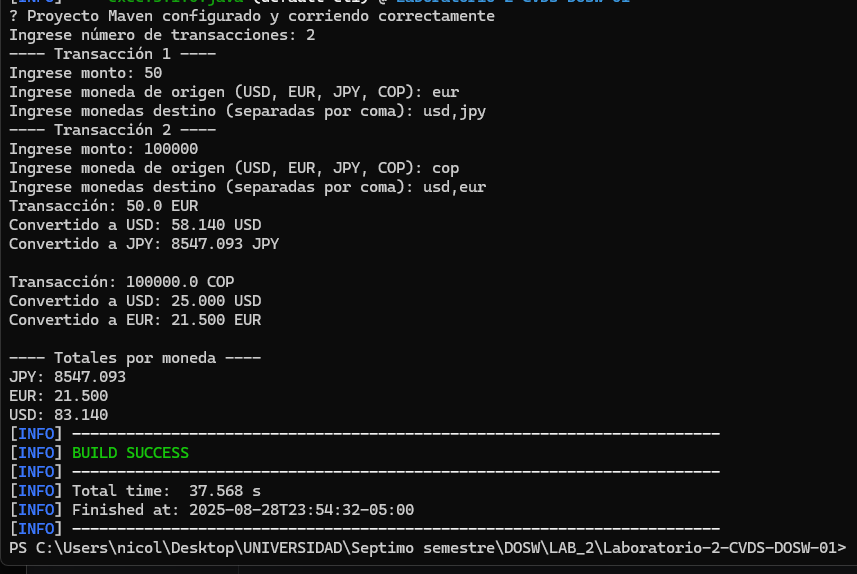
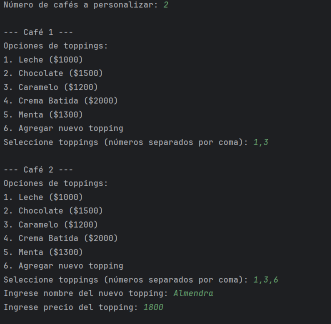
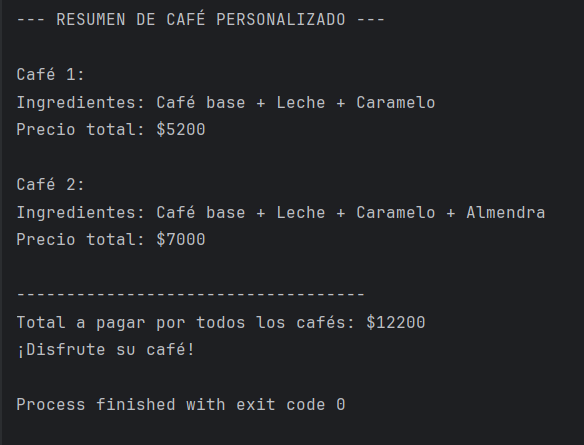
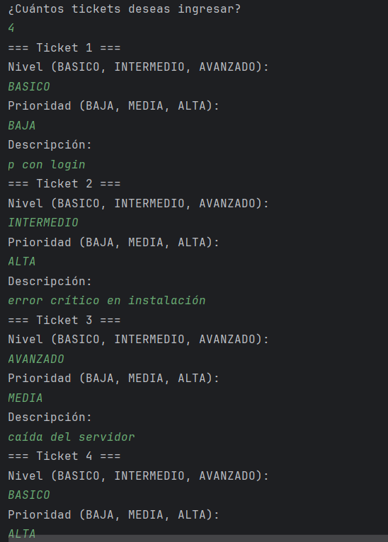
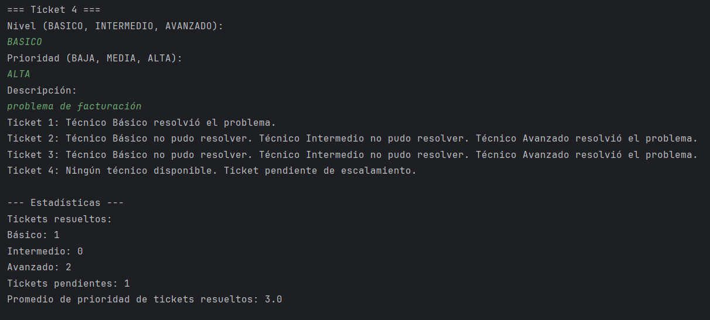

# Laboratorio-2-CVDS-DOSW-01

\# Laboratorio 02 - SOLID, Patrones de Diseno y UML

\*\* Integrantes :\*\*

\- DEISY LORENA GUZMAN 

\- NICOLAS ANDRES DUARTE

\- JUAN PABLO NIETO 

\*\* Nombre de la rama :\*\*

`feature/GuzmanDeisy\_NietoJuan\_DuarteNicolas\_2025-2'

\##

Retos Completados
## Reto 3
Patrón de Diseño:
Creacional

Patrón Utilizado:
Abstract Factory

Justificación:

El patrón Abstract Factory permite la creación de familias de objetos relacionados sin especificar sus clases concretas. Este patrón resulta útil cuando se requiere que un sistema sea independiente de cómo se crean, componen y representan sus objetos.

En este caso, se adapta perfectamente al sistema de fabricación de vehículos, ya que se necesita crear distintos tipos de vehículos (terrestres, acuáticos y aéreos) sin acoplar el código a clases concretas. El sistema puede escalar fácilmente al agregar nuevas categorías o tipos de vehículos sin modificar la lógica del cliente.

Cómo se aplicó:

Se definió una interfaz abstracta AbstractVehicleFactory que declara el método createVehicle(String type), encargado de instanciar vehículos según el tipo solicitado.

Se implementaron tres fábricas concretas que extienden esta interfaz:

TierraVehicleFactory: crea vehículos terrestres como Auto, Moto, y Bici.

AcuaticoVehicleFactory: crea vehículos acuáticos como Lancha, Velero y JetSki.

AereoVehicleFactory: crea vehículos aéreos como Avion, Avioneta, y Helicoptero.

Se creó la clase FactoryProducer, encargada de seleccionar la fábrica correspondiente según la categoría del vehículo (tierra, aire o agua), desacoplando aún más la lógica del cliente de la creación de objetos.

Cada vehículo implementa la interfaz común Vehicle, asegurando una estructura unificada.

## Reto 4
Patrón de Diseño:
Comportamiento.

Patrón Utilizado:
Strategy.

Justificación:
El patrón Strategy permite definir una familia de algoritmos y encapsularlos en clases separadas, haciendo que sean intercambiables sin modificar el código del cliente.
En el caso de la casa de cambio, se adapta perfectamente porque se pueden definir múltiples formas de conversión de moneda. El sistema puede cambiar de estrategia fácilmente sin necesidad de modificar la lógica central de procesamiento de transacciones.

Cómo se aplicó:

Se definió la interfaz ConversionStrategy con el método convert(double amount, String from, String to).

StandardConversion implementa la estrategia de conversión básica utilizando un mapa de tasas fijas actuales con respecto al dólar por lo que no da exactamente igual al ejemplo brindado pero si se rectifica que funciona correctamente.

ExchangeService recibe una estrategia de conversión como dependencia, lo que permite que el servicio funcione con cualquier implementación de ConversionStrategy.

Gracias a esta separación, agregar nuevas estrategias no requiere modificar el servicio ni las clases de transacciones.

## Reto 5
Patrón de Diseño:
Estructural.

Patrón Utilizado:
Decorator.

Justificación:
El patrón Decorator permite añadir responsabilidades adicionales a un objeto de manera dinámica, sin modificar la clase original. Esto se adapta al caso de la cafetería porque se pueden agregar distintos toppings a un café sin alterar la definición de la clase CaféBase.

Cómo se aplicó:
La clase Cafe define la interfaz base con métodos getDescripcion() y getPrecio().
CafeBase es el producto simple (solo café).
Cada ToppingDecorator envuelve un café y añade descripción + precio.
Con esto, podemos personalizar cualquier café con X toppings, incluyendo toppings nuevos que se definan en tiempo de ejecución.
Finalmente, con streams se calcula el total de varios cafés.

## Reto 6
Patrón de diseño: De comportamiento

Patrón utilizado: Chain of Responsibility

Justificación: Se utiliza este patrón porque permite que una solicitud (ticket) 
sea pasada a través de una cadena de objetos (técnicos) hasta que alguno pueda manejarla.
Así evitamos acoplar el ticket a un técnico específico.

Cómo se aplicó:
Cada técnico implementa la clase abstracta Tecnico, y si no puede resolver el ticket 
lo pasa al siguiente en la cadena. Si ninguno lo resuelve, el ticket queda como pendiente 
de escalamiento. Además, se usan Streams para obtener estadísticas como tickets resueltos 
por nivel, pendientes y promedio de prioridades.

