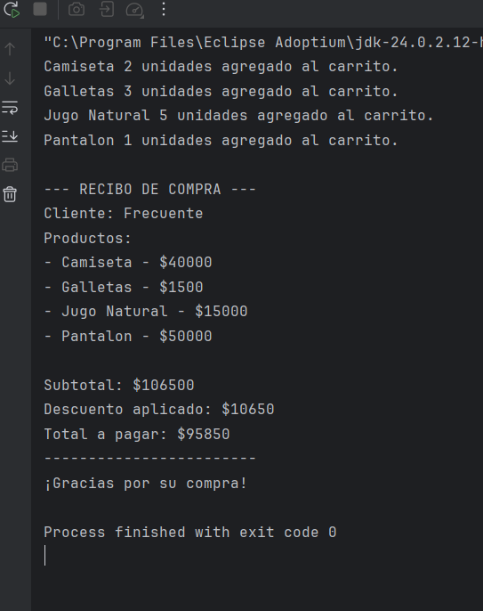
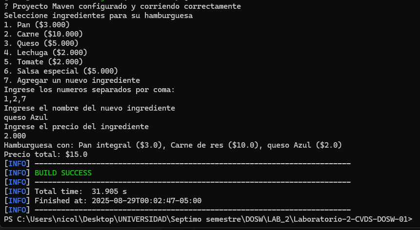
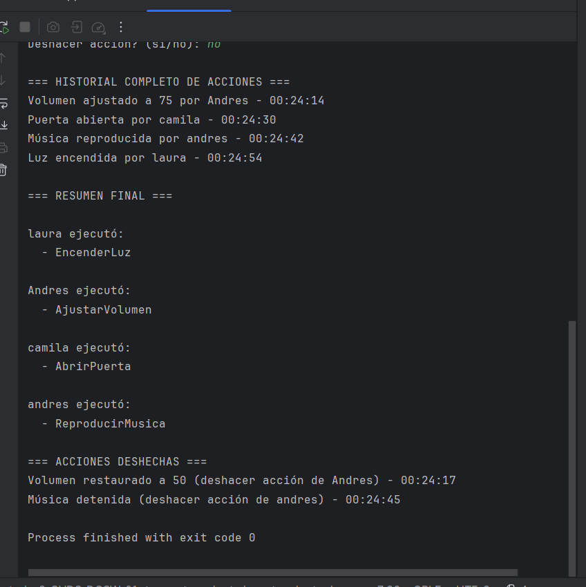
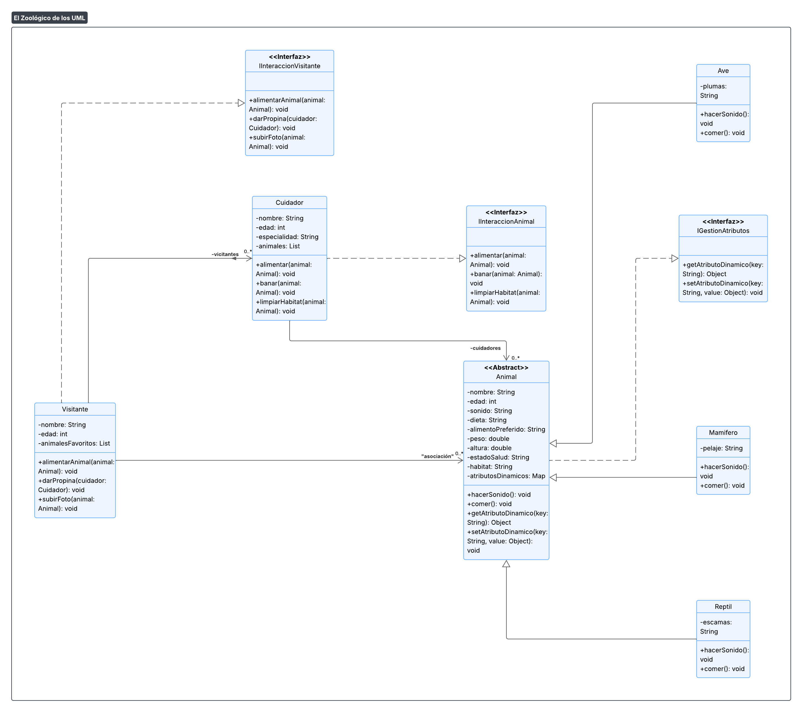

# Laboratorio-2-CVDS-DOSW-01

\# Laboratorio 02 - SOLID, Patrones de Diseno y UML

\*\* Integrantes :\*\*

\- DEISY LORENA GUZMAN 

\- NICOLAS ANDRES DUARTE

\- JUAN PABLO NIETO 

\*\* Nombre de la rama :\*\*

`feature/GuzmanDeisy\_NietoJuan\_DuarteNicolas\_2025-2'

\## Retos Completados

## Reto 1
**Patrón de Diseño:**  
Comportamental

**Patrón Utilizado:**  
Strategy

**Justificación:**  
El patrón Strategy permite definir un conjunto de algoritmos y encapsularlos en clases independientes, haciendo posible intercambiarlos de manera dinámica sin modificar la lógica central.

En el caso del Reto 1 (cálculo de descuentos para diferentes tipos de clientes), se adapta perfectamente porque cada tipo de cliente (nuevo, frecuente, VIP, etc.) puede tener una forma distinta de calcular el descuento. Usando Strategy, es posible añadir nuevos tipos de descuento sin modificar la clase principal, manteniendo el código flexible y abierto a extensiones según el **principio abierto/cerrado (OCP)** de SOLID.

**Cómo se aplicó:**
- Se definió la interfaz `DescuentoStrategy` con el método `calcularDescuento(double total)`.
- Cada estrategia concreta (`NuevoClienteDescuento`, `ClienteFrecuenteDescuento`, `ClienteVIPDescuento`) implementa la lógica de cálculo de descuento de manera independiente.
- La clase `Carrito` actúa como **contexto**, ya que mantiene una referencia a una estrategia de descuento y delega el cálculo a ella.
- Gracias a esta separación, el sistema puede cambiar la estrategia de descuento en tiempo de ejecución sin modificar el código central del carrito.

## Reto 2
Patrón de Diseño:
Creacional

Patrón Utilizado:
Builder

Justificación:

El patrón Builder permite construir objetos complejos paso a paso, separando la construcción del objeto de su representación final. Este patrón es ideal cuando un objeto puede tener múltiples combinaciones posibles, como en este caso: una hamburguesa personalizada con distintos ingredientes.

Este patrón se adapta perfectamente al problema planteado, ya que permite al usuario elegir los ingredientes que desea para construir su hamburguesa de forma dinámica, sin necesidad de múltiples constructores o clases especializadas para cada combinación.

Cómo se aplicó:

Se creó la clase Hamburguesa, que representa el producto final. Esta clase incluye una lista de ingredientes y métodos como calcularPrecio() y toString() para mostrar el contenido de la hamburguesa y su costo total.

Dentro de Hamburguesa, se definió una clase estática anidada llamada Builder. Esta clase actúa como el constructor especializado, permitiendo agregar ingredientes paso a paso mediante el método agregarIngrediente(Ingrediente ingrediente). Finalmente, el método build() construye y devuelve una instancia de Hamburguesa.

La clase Ingrediente encapsula el nombre y el precio de cada componente de la hamburguesa. Permite representar los ingredientes de manera clara y reutilizable.

La clase Constructor actúa como el director del proceso de construcción. Presenta un menú interactivo al usuario para que seleccione los ingredientes deseados (ya sea de una lista predeterminada o agregando nuevos). Luego, construye la hamburguesa utilizando el Builder.

Finalmente, Reto2 contiene el método run() que inicia el proceso, funcionando como punto de entrada del sistema.

## Reto 3
Patrón de Diseño:
Creacional

Patrón Utilizado:
Abstract Factory

Justificación:

El patrón Abstract Factory permite la creación de familias de objetos relacionados sin especificar sus clases concretas. Este patrón resulta útil cuando se requiere que un sistema sea independiente de cómo se crean, componen y representan sus objetos.

En este caso, se adapta perfectamente al sistema de fabricación de vehículos, ya que se necesita crear distintos tipos de vehículos (terrestres, acuáticos y aéreos) sin acoplar el código a clases concretas. El sistema puede escalar fácilmente al agregar nuevas categorías o tipos de vehículos sin modificar la lógica del cliente.

Cómo se aplicó:

Se definió una interfaz abstracta AbstractVehicleFactory que declara el método createVehicle(String type), encargado de instanciar vehículos según el tipo solicitado.

Se implementaron tres fábricas concretas que extienden esta interfaz:

TierraVehicleFactory: crea vehículos terrestres como Auto, Moto, y Bici.

AcuaticoVehicleFactory: crea vehículos acuáticos como Lancha, Velero y JetSki.

AereoVehicleFactory: crea vehículos aéreos como Avion, Avioneta, y Helicoptero.

Se creó la clase FactoryProducer, encargada de seleccionar la fábrica correspondiente según la categoría del vehículo (tierra, aire o agua), desacoplando aún más la lógica del cliente de la creación de objetos.

Cada vehículo implementa la interfaz común Vehicle, asegurando una estructura unificada.

## Reto 4
Patrón de Diseño:
Comportamiento.

Patrón Utilizado:
Strategy.

Justificación:
El patrón Strategy permite definir una familia de algoritmos y encapsularlos en clases separadas, haciendo que sean intercambiables sin modificar el código del cliente.
En el caso de la casa de cambio, se adapta perfectamente porque se pueden definir múltiples formas de conversión de moneda. El sistema puede cambiar de estrategia fácilmente sin necesidad de modificar la lógica central de procesamiento de transacciones.

Cómo se aplicó:

Se definió la interfaz ConversionStrategy con el método convert(double amount, String from, String to).

StandardConversion implementa la estrategia de conversión básica utilizando un mapa de tasas fijas actuales con respecto al dólar por lo que no da exactamente igual al ejemplo brindado pero si se rectifica que funciona correctamente.

ExchangeService recibe una estrategia de conversión como dependencia, lo que permite que el servicio funcione con cualquier implementación de ConversionStrategy.

Gracias a esta separación, agregar nuevas estrategias no requiere modificar el servicio ni las clases de transacciones.

## Reto 5
Patrón de Diseño:
Estructural.

Patrón Utilizado:
Decorator.

Justificación:
El patrón Decorator permite añadir responsabilidades adicionales a un objeto de manera dinámica, sin modificar la clase original. Esto se adapta al caso de la cafetería porque se pueden agregar distintos toppings a un café sin alterar la definición de la clase CaféBase.

Cómo se aplicó:
La clase Cafe define la interfaz base con métodos getDescripcion() y getPrecio().
CafeBase es el producto simple (solo café).
Cada ToppingDecorator envuelve un café y añade descripción + precio.
Con esto, podemos personalizar cualquier café con X toppings, incluyendo toppings nuevos que se definan en tiempo de ejecución.
Finalmente, con streams se calcula el total de varios cafés.

## Reto 6
Patrón de diseño: De comportamiento

Patrón utilizado: Chain of Responsibility

Justificación: Se utiliza este patrón porque permite que una solicitud (ticket) 
sea pasada a través de una cadena de objetos (técnicos) hasta que alguno pueda manejarla.
Así evitamos acoplar el ticket a un técnico específico.

Cómo se aplicó:
Cada técnico implementa la clase abstracta Tecnico, y si no puede resolver el ticket 
lo pasa al siguiente en la cadena. Si ninguno lo resuelve, el ticket queda como pendiente 
de escalamiento. Además, se usan Streams para obtener estadísticas como tickets resueltos 
por nivel, pendientes y promedio de prioridades.

## Reto 7
**Patrón de Diseño:**  
Comportamental

**Patrón Utilizado:**  
Command

**Justificación:**  
El patrón Command permite encapsular una solicitud como un objeto, lo que posibilita parametrizar clientes con diferentes solicitudes, encolar operaciones, implementar un historial de acciones y ofrecer la opción de deshacer acciones previamente ejecutadas.

En el caso del **Reto 7 (control remoto mágico)**, este patrón es ideal porque cada acción (encender luz, abrir puerta, reproducir música, ajustar volumen) puede ser representada como un **objeto comando independiente**. Esto permite:

- **Deshacer acciones:** Cada comando implementa la operación `undo()`.
- **Historial de acciones:** Los comandos ejecutados se almacenan para su posterior revisión.
- **Parametrización:** Algunos comandos aceptan parámetros específicos (como el nivel de volumen).
- **Rastreo de usuario:** Cada comando registra qué usuario ejecutó la acción.

El patrón Command sigue:
- El **principio de responsabilidad única (SRP)**, separando la invocación de la ejecución.
- El **principio abierto/cerrado (OCP)**, permitiendo añadir nuevos comandos sin modificar el invocador.

**Cómo se aplicó:**
- Se definió la interfaz `Command` con los métodos `execute()` y `undo()`.
- Cada comando concreto (`EncenderLuzCommand`, `AbrirPuertaCommand`, `ReproducirMusicaCommand`, etc.) implementa la lógica específica.
- La clase `ControlRemoto` actúa como **invocador**, manteniendo el historial de comandos ejecutados.
- Cada comando almacena información del usuario que lo ejecutó para el rastreo posterior.
- El sistema puede deshacer cualquier acción individual gracias a la implementación del método `undo()`.

## Reto 8
**Patrón de Diseño:**  
Estructural y Creacional

**Patrones Utilizados:**
- Composite (para atributos dinámicos de los animales)
- Factory Method (para la creación de diferentes tipos de animales: Mamífero, Ave, Reptil)

**Justificación:**  
El patrón Composite permite que cada `Animal` tenga una colección de `AtributoDinamico`, los cuales pueden variar (color de pelaje, rareza, historial médico, origen). Esto evita modificar la clase base cada vez que se necesite agregar un nuevo atributo.

El patrón Factory Method facilita la creación de nuevos animales sin acoplar el código a clases concretas (`Mamifero`, `Ave`, `Reptil`). De esta forma, el sistema puede instanciar nuevas especies sin alterar el código ya existente.

En el caso del Reto 8 (Zoológico UML), estos patrones son ideales porque:
- Los animales pueden crecer en atributos y especies sin romper la aplicación.
- Los cuidadores y visitantes trabajan siempre con la abstracción `Animal`.
- Se asegura flexibilidad y extensibilidad en el modelo.

Los patrones utilizados cumplen con:
- El principio de responsabilidad única (SRP), separando responsabilidades en clases específicas.
- El principio abierto/cerrado (OCP), permitiendo añadir nuevas especies o atributos dinámicos sin modificar el código existente.
- El principio de sustitución de Liskov (LSP), ya que un `Mamifero`, `Reptil` o `Ave` puede sustituir a un `Animal` sin afectar la lógica.
- El principio de segregación de interfaces (ISP), dado que se podrían crear interfaces específicas como `IAlimentable` o `ICuidable` sin forzar métodos innecesarios.
- El principio de inversión de dependencias (DIP), ya que cuidadores y visitantes dependen de la abstracción `Animal` y no de implementaciones concretas.

**Cómo se aplicó:**
- Se definió la clase abstracta `Animal` con atributos comunes y métodos como `hacerSonido()` y `mostrarInformacion()`.
- Se creó la jerarquía con `Mamifero`, `Ave` y `Reptil`, aplicando herencia y polimorfismo.
- Se diseñó la clase `AtributoDinamico` para manejar propiedades flexibles de los animales aplicando el patrón Composite.
- Se planteó el uso de un Factory Method para instanciar nuevas especies de animales.
- Se establecieron asociaciones en el UML:
    - `Cuidador` ↔ `Animal` (cuidado)
    - `Visitante` ↔ `Animal` (observa, alimenta, fotografía)
    - `Visitante` ↔ `Cuidador` (propinas)
- Se aplicó encapsulamiento en todas las clases mediante atributos privados y métodos getters y setters.  

