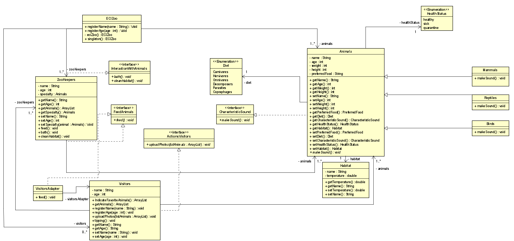
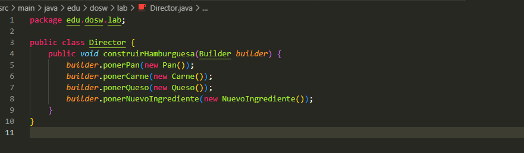
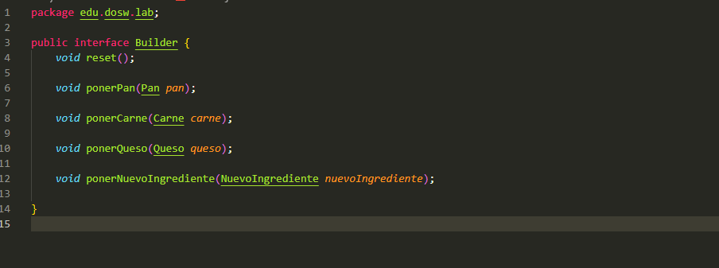
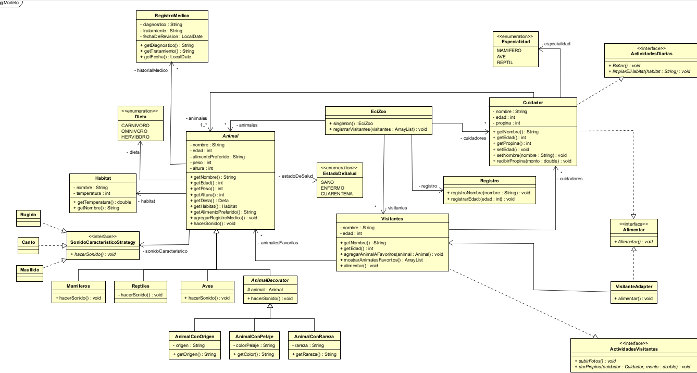
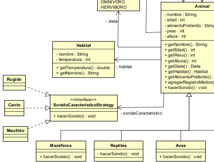
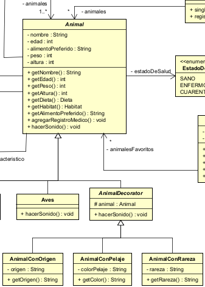
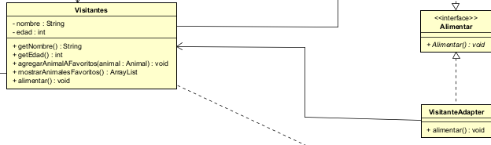

# Laboratorio 02 – SOLID, Patrones de Diseño y UML

---

## 👥 Integrantes
- **Sebastian Barros**  
- **Karol Estupiñan**  
- **Juan Puentes**  

📌 **Nombre de la rama:**  
`feature/EstupiñanKarol_PuentesJuan_BarrosSebastian_2025-2`

---

## ✅ Retos Completados

---

###  Reto 1

#### Evidencia del código de la solución implementada:

#### Explicación
Producto: Solo maneja datos del producto
Carrito: Solo gestiona items del carrito
Factura: Solo genera recibos
CatalogoProductos: Solo maneja el inventario
Cada clase tiene una razón específica para cambiar

Se puede agregar nuevos tipos de cliente sin modificar Cliente.java
Se puede agregar nuevos productos sin cambiar la lógica del carrito o de los productos

(Dependency Inversion Principle):
Carrito depende de la abstracción Producto, no de implementaciones concretas

Para resolver el problema, no consideramos necesario utilizar el polimorfismo, sin embargo, el codigo esta escrito de tal forma que soporta el polimorfismo si se extiende el codigo. Por ejemplo, al momento de calcular el subtotal de los productos en el carrito, si extendieramos la clase Item, podriamos calcular el subtotal de items que pertenecen a diferentes clases sin problema.

La mayoria de atributos son private y se accede a ellos por medio de getters cuando sea necesario.

#### Evidencia de la ejecución:

---

###  Reto 2 – Patrón **Builder**

#### Evidencia #1

#### Explicación
- **Patrón de Diseño:** Creacional.  
- **Patrón Utilizado:** **Builder**.  
- **Justificación:** El patrón Builder permite la **creación de objetos complejos paso a paso**, lo cual resulta ideal cuando se deben armar productos con múltiples combinaciones posibles.  
- **Aplicación:**  
  - Se definió una **interfaz Builder** con los métodos necesarios para construir el objeto (en este caso, la hamburguesa).  
  - Se creó una clase concreta `HamburguesaBuilder` que implementa los métodos de la interfaz para realizar la construcción.  

#### Evidencia #2
  
  
  

---

###  Reto 3 - Patrón Abstract Factory

#### Evidencia de la ejecución:

#### Explicación
**Patrón de Diseño:** Creacional.
**Patrón Utilizado:** Abstract Factory.
**Justificación:** Este patron nos permite crear familias de objetos relacionados, en este ejercicio, debemos crear diferentes variantes de vehiculos, por lo que este patron es ideal. 
**Aplicación:** Creamos la clase abstracta VehiculoAbstractFactory, con el metodo crearVehiculo
Luego, creamos una Factory para los vehiculos, economicos, de lujo y usados que extiende a VehiculoAbstractFactory y contiene los llamados a los constructores. De esta forma, ya sabiendo el vehiculo que quiera el usuario, solo debemos crear la factory apropiada y pasarle los parametros requeridos al constructor de Vehiculo. 

#### Evidencia #2

---

### Reto 4 - Patron Strategy

##### Evidencia #1:

#### Explicación

- **Patrón de Diseño:**Comportamiento.

- **Patrón Utilizado:** **Strategy**.

- **Jusificación:**La usamos ya que el patrón Strategy se utiliza cuando se tienen múltiples algoritmos o formas de realizar una misma operación, y se desea elegir la estrategia adecuada en tiempo de ejecución sin cambiar el código principal.

En este caso, la operación principal es convertir dinero de una moneda a otra, y la estrategia de conversión depende de la tasa que se use (antes era una sola tasa fija para todas las monedas, ahora se usan tasas reales por cada combinación de monedas).
- **Aplicacion:**
-Definimos una interfaz de estrategia con un método convertir.

-La clase Transaccion recibe una estrategia en su constructor en este caso es ConversorMonedas conversor y la utiliza para hacer la conversión.

#### Evidencia #2

###  Reto 5 – Patrón **Decorator**

#### Evidencia #1

#### Explicación
- **Patrón de Diseño:** Estructural.  
- **Patrón Utilizado:** **Decorator**.  
- **Justificación:** Este patrón permite extender las funcionalidades de un objeto en tiempo de ejecución, sin necesidad de modificar el código base.  
- **Aplicación:**  
  - Se definió una **interfaz base** que contiene los métodos que deben implementar todos los componentes (toppings).  
  - Se creó una **clase decoradora abstracta**, la cual envuelve a un objeto del mismo tipo y delega las operaciones hacia él.  
  - Finalmente, cada **topping concreto** hereda de la clase decoradora, agregando su propia lógica (sumar costo y añadir descripción).  

#### Evidencia #2
  
  
  

---

### Reto 6 - Patrón **Chain of responsability**

##### Evidencia #1:

#### Explicación

- **Patrón de Diseño:**Comportamiento.

- **Patrón Utilizado:** **Chain of responsability**.

- **Jusificación:**La usamos porque en este caso se ve explícitamente una cadena de responsabilidad, ya que, por decirlo así, los técnicos tienen rangos. Si no les corresponde a ellos resolver un ticket, lo pasarán a su superior, si existe. Además, para que se note más claramente, hicimos que cada técnico pueda revisar únicamente los tickets de su nivel, pero con una dificultad más alta. Por ejemplo, el técnico básico puede revisar los tickets de nivel básico con dificultad baja o media.

- **Aplicacion:**
- Hicimos una interfaz de tecnico donde la accion de passar al siguiente y donde especificamos que tengan un siguiente para lograr asi la cadena de responsabilidad.
- Asignamos los puestos dela cadena en nuestra clase principal llamada reto6.
- Hicimos una clase aparte para las estadisticas usando streams.

#### Evidencia #2

---

### Reto 7 - Patrón **Command**

##### Evidencia #1:

#### Explicación

- **Patrón de Diseño:**Comportamiento.

- **Patrón Utilizado:** **Command**.

- **Jusificación:** La usamos porque este patron nos permite encapsular las solicitudes como objetos, y era lo que necesitamos aca por las acciones del contro remoto como encender luz,subir volumen, etc.

- **Aplicacion:**
- Se creo una interfaz comand para que cada accion implemente las acciones necesarias.
- Creamos cada accion(Encender luz,subir volumen, ...) para que implementan la interfaz para realizar sus acciones.
- Por ultimo, creamos una clase control donde hacemos el historial y  resumen, de cada una de las acciones que elije el usuario.

#### Evidencia #2

---

###  Reto 8 – **UML**

Evidencia del Diagrama De Clases:

Explicacion Diseño:
- 1. Clases Principales: Se crean las clases Animal, Visitantes, EciZoo y Cuidador.

  La clase Animal tiene asociado un RegistroMedico, una Dieta, un Habitat, un Estado de Salud y un SonidoCaracterístico, el cual se maneja a través del patrón Strategy.

  Por otro lado, los Visitantes tienen asociado muchos Animales, los cuales son sus favoritos, y son capaces de alimentarlos, subir fotos de ellos y brindar propinas a los cuidadores. Para el registro de los mismos, EciZoo delega dicho comportamiento a una clase llamada Registro.

  Los Cuidadores, por su parte, se encargan de realizar las actividades diarias del zoológico, tales como bañar a los animales y limpiar los hábitats. Además, cada cuidador tiene una especialidad (mamífero, ave o reptil) y puede recibir propinas de los visitantes como recompensa por su labor.

- 2. Patrones Utilizados Y Principios SOLID:

  Como se dijo anteriormente, se usó el patrón Strategy para implementar el sonido característico de cada animal mediante la creación de una interfaz, donde las clases Rugido, Canto y Maullido la implementan. Luego, cada Animal instancia una de estas estrategias de sonido, lo que permite que el comportamiento pueda variar dinámicamente sin necesidad de modificar la clase base. De esta manera, se cumple con el principio de abierto/cerrado y se facilita la extensibilidad si se llegara a requerir nuevos sonidos.

  

  Por otro lado, para los atributos dinámicos requeridos se implementó el patrón Decorator, ya que no todos los animales necesariamente cuentan con ciertas características adicionales como pelaje, origen o rareza. Con este enfoque, se evita sobrecargar la clase base Animal con atributos que no son comunes a todos.
  Se definió la clase abstracta AnimalDecorator, que extiende de Animal y permite envolver a cualquier instancia de un animal con nuevos comportamientos o atributos.

  

  Asimismo, los cuidadores y visitantes tienen la opción de alimentar a los animales, sin embargo, no lo hacen de la misma manera, por lo que se implementó el patrón Adapter. Para ello, se definió la interfaz Alimentar, la cual establece el contrato común del metodo alimentar(). La clase VisitanteAdapter implementa esta interfaz y actúa como un puente entre la clase Visitantes. De esta manera, se logra unificar el comportamiento de estos actores.

  
    
  Finalmente, como se mencionó antes, la clase Registro nos ayuda a cumplir con el principio de Unica Responsabilidad, ya que concentra únicamente las funciones relacionadas con el registro de visitantes y no sobrecarga a la clase principal EciZoo. Asimismo, las interfaces creadas permiten dar cumplimiento al principio de Segregación de Interfaces, pues cada interfaz define comportamientos específicos y evita que las clases deban implementar métodos que no necesitan. Por otro lado, la extensión de la clase Animal mediante herencia y decoradores garantiza la extensibilidad del sistema siguiendo el principio de Abierto/Cerrado, ya que se pueden añadir nuevas características y comportamientos sin modificar las clases existentes. De esta manera, seguimos estos principios para el buen desarrollo de software.

---
 
