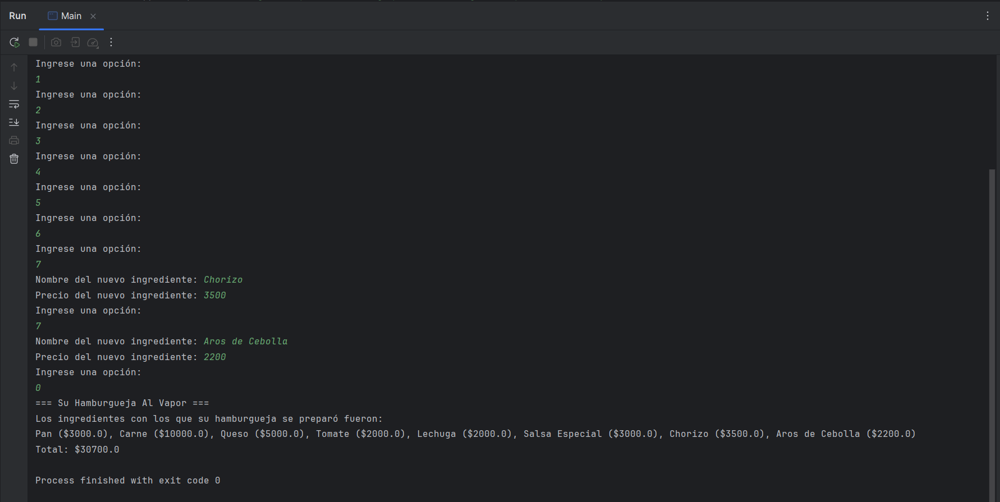
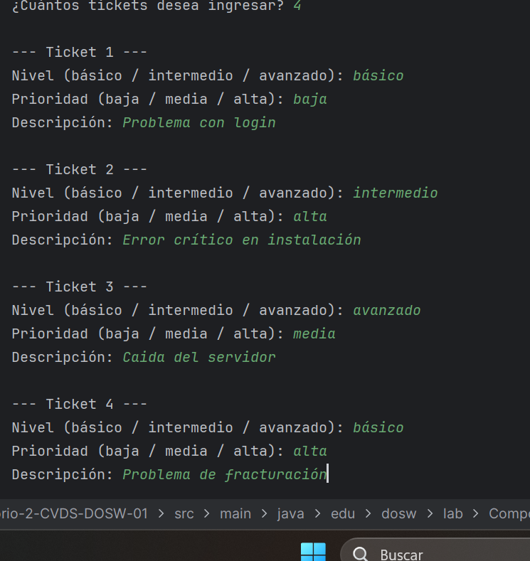
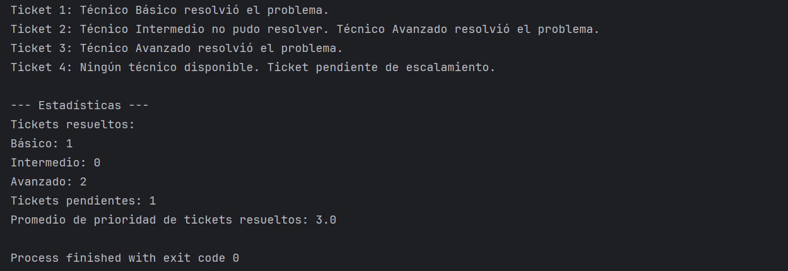
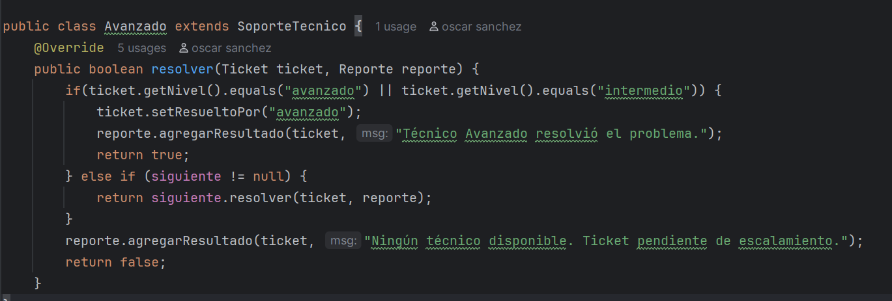
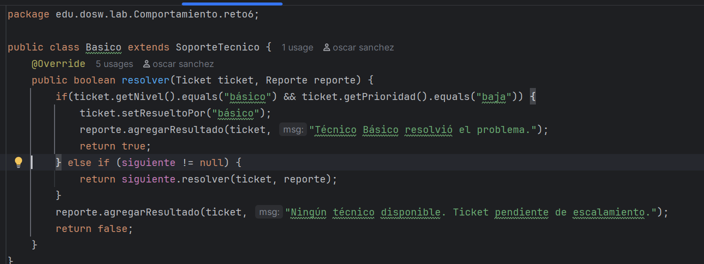
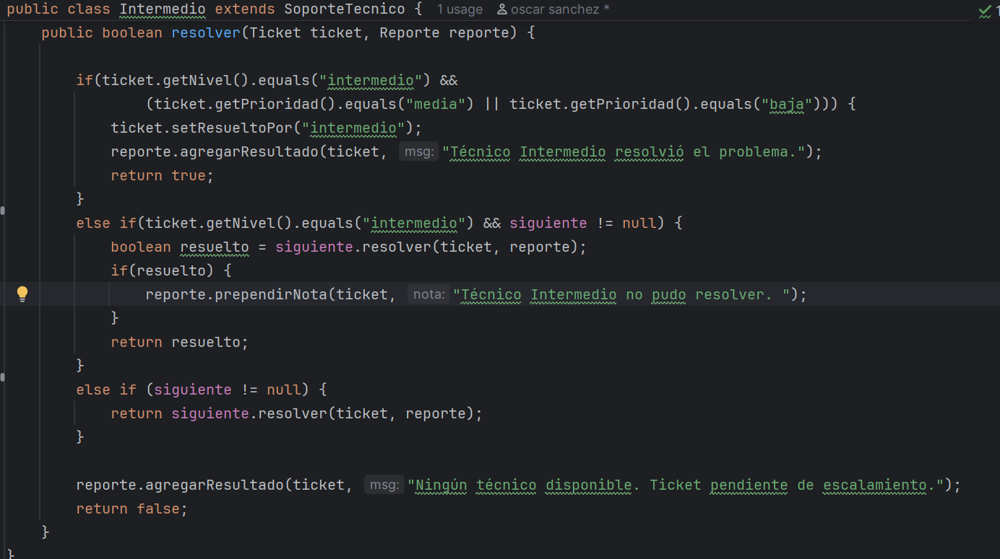
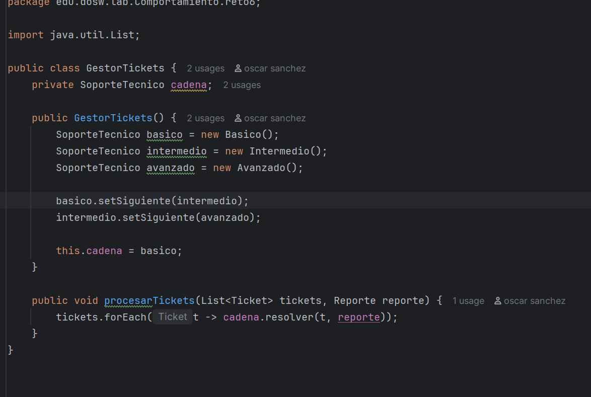
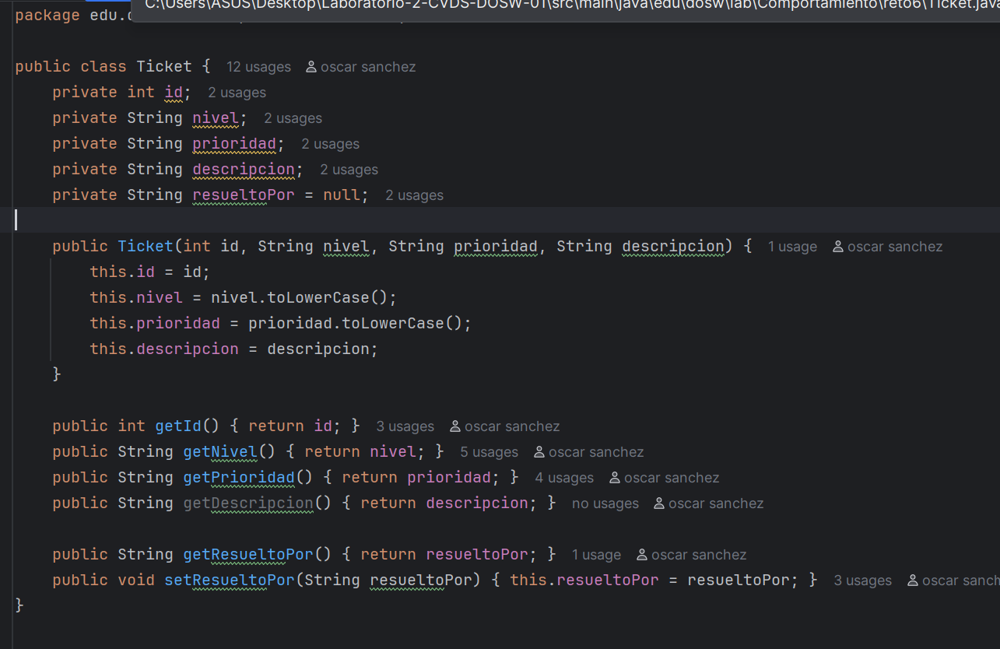
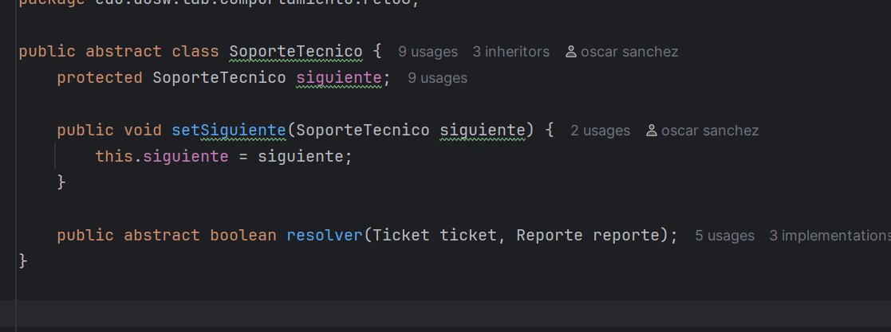
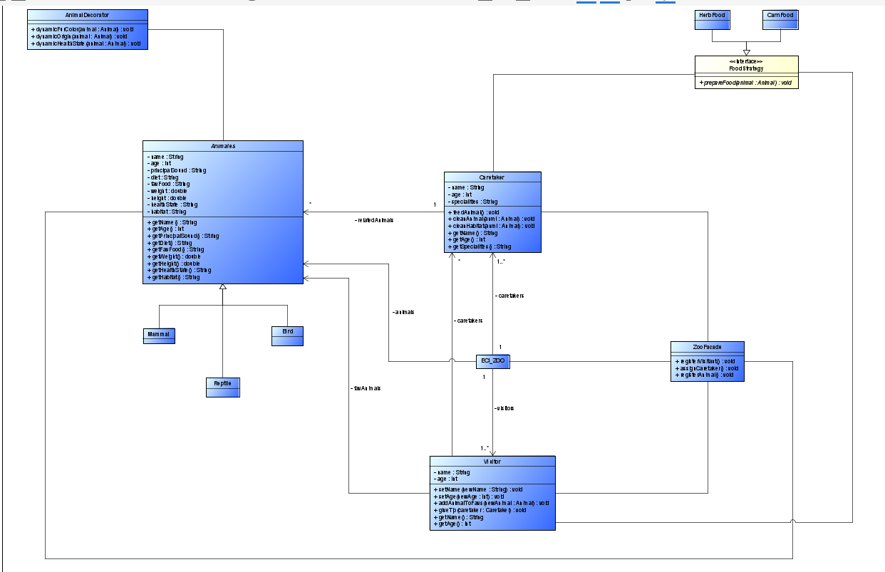

# Laboratorio-2-CVDS-DOSW-01
# 📝 Laboratorio 02 – SOLID, Patrones de Diseño y UML

**Integrantes:**
- Oscar Sanchez
- Julian Ramirez
- Valeria Bermudez

**Nombre de la rama:**
`feature/SanchezOscar_RamirezJulian_BermudezValeria`

✅ Retos Completados
### Reto 1: El problema de la tienda de Don Pepe
**Evidencia:**

<h4>Descripción breve de lo que hicieron:  
</h4>
Se implementó un sistema sencillo de compras para la tienda de Don Pepe aplicando principios de SOLID. Creamos clases para representar productos (Producto), ítems en el carrito (ItemCarrito) y el carrito de compras (CarritodeCompras). Se definieron tipos de clientes (ClienteNuevo, ClienteFrecuente) que aplican distintos tipos de descuentos mediante el tipo de cliente (DescuentoNu, DescuentoFe). Además, se creó la interfaz Irecibo y su implementación Imrecibo para generar un recibo con detalle de productos, subtotal, descuento aplicado y total a pagar.

### Reto 2: El restaurante 5 estrellas.
**Evidencia:**

<h4>Descripción breve de lo que hicieron:  
</h4>
- Patrón de Diseño: Creacional.
- Patrón Utilizado: El Patrón Builder, pues provee diversos mecanismos para el proceso de creación de objetos sin tener que recurrir a la instanciación por 'new'. En otras palabras, permite crear objetos sin acoplar mucho código.
- Justificación de su uso: Da campo a la construcción secuencial (paso a paso) de objetos complejos. Así se podrán producir distintas 'representaciones' de un objeto usando siempre el mismo código de construcción.

- Como fue aplicado:
Se comenzó por construir la clase 'Ingredients' con el fin de precisamente definir a cada uno de los ingredientes de la hamburguesa por su nombre y por supuesto, su precio. Posteriormente se modeló la clase 'Burger' cuyo fin es 
'acumular' el o los ingredientes que el usuario decida utilizar. 
Con Ingredients y Burger listos, continuamos con BurgerBuilder. Clase cuyo propósito es concretar el objeto hamburguesa (según sus posibles combinaciones de ingredientes) sin recurrir a un constructor grandísimo o incluso, sin 
recurrir a varios constructores según para cada caso. Finalmente Main toma las riendas de la interacción con el usuario; a través de un menú dinámico este podrá conocer la lista de ingredientes disponibles y sus precios. Además
cuenta con la opción de agregar su propio nuevo ingrediente.
Al elegir la opción 0, se cierra el proceso del pedido y el programa imprime el recibo del consumidor.

### Reto 3: El Reino de los Vehículos
**Evidencia:**

<h4>Descripción breve de lo que hicieron:  
</h4>

Nuestro grupo desarrolló un sistema en Java aplicando el patrón Factory Method para la creación de vehículos de tierra, acuáticos y aéreos.

Se implementó una clase abstracta Vehiculo y subclases como Auto, Moto, Bicicleta, Lancha, Velero, Avion, Avioneta, entre otras. La clase VehiculoFactory centraliza la creación de los objetos según las elecciones del usuario.

El sistema cuenta con un menú interactivo en consola donde el usuario selecciona el tipo, categoría y modelo de vehículo, y finalmente se genera un resumen de compra en pesos colombianos, mostrando precios, características y el total a pagar.
---

### Reto 4: La Estafa de la Casa de cambio
**Evidencia:**

<h4>Descripción breve de lo que hicieron:  
</h4>
En este código se usa polimorfismo para que las Transacciones trabajen con la interfaz Conversora sin importar qué implementación concreta se use,
lo que permite invocar el mismo método con diferentes comportamientos.
Además, se aplica el patrón Strategy, ya que la lógica de la conversión de monedas se encapsula en clases que se implementan en la Conversorcion (como ConversorTasas),
y Transacciones delega en ellas el algoritmo de conversión, permitiendo cambiar fácilmente la estrategia sin modificar la clase principal.
---
### Reto 5: El café Personalizado
**Evidencia:**

<h4>Descripción breve de lo que hicieron:  
</h4>
- Patrón de Diseño: Decorator (Patrón Decorador)
- Patrón Utilizado: Decorator permite añadir funcionalidades adicionales a un objeto de manera dinámica sin modificar su clase base.
- Justificación: Se utiliza para personalizar cafés con distintos toppings sin crear subclases para cada combinación posible. Esto hace que el sistema sea más flexible y escalable.
- Como Lo aplico responde esto:
    - La clase Base representa el café base.
    - La clase abstracta Decoration implementa la interfaz Coffee y mantiene una referencia al café que decora.
    - La clase Topping extiende Decoration y añade un topping específico, modificando la descripción y el costo del café.
    - ToppingFactory gestiona la creación de toppings y permite agregar toppings personalizados dinámicamente.
    - En Reto5, se aplican los toppings sobre cada café usando el patrón decorador, combinando múltiples toppings de manera dinámica.
---

### Reto 6: Habla con Soporte Técnico
**Evidencia:**

<h4>Descripción breve de lo que hicieron:  
</h4>
- Patrón de Diseño: Chain of Responsibility
- Patrón Utilizado: Subclases con polimorfismo
- Justificación:
  - Cada técnico decide si puede resolver un ticket según su nivel y prioridad.
  - Si no puede resolverlo, lo pasa al siguiente técnico de la cadena.
  - Esto evita condicionales extensos y centraliza la lógica de resolución en cada clase.
- Cómo lo apliqué:
  - La clase abstracta SoporteTecnico define el método resolver() y mantiene referencia al siguiente técnico.
  -   Las subclases (Basico, Intermedio, Avanzado) implementan la resolución según reglas específicas.
  -   GestorTickets arma la cadena y procesa todos los tickets.
  - Reporte recibe los resultados y calcula estadísticas, mostrando quién resolvió cada ticket.
---
### Reto 7: El control remoto
**Evidencia:**

<h4>Descripción breve de lo que hicieron:  
</h4>
En este reto implementamos un control remoto mágico que permite ejecutar y deshacer acciones sobre diferentes dispositivos del hogar como luces, puertas, música y volumen.
Para la solución utilizamos el patrón de diseño Command, ya que nos permitió encapsular cada acción en una clase independiente y mantener un historial de lo que se ejecutó y quién lo hizo.

Durante el desarrollo, cada integrante del grupo aportó en diferentes partes:
algunos trabajaron en la definición de los comandos y receptores, otros en la lógica del historial y el análisis de los usuarios, y finalmente se integró todo en el programa principal.
Al final, el sistema permite registrar acciones con parámetros, deshacerlas cuando sea necesario y mostrar un resumen completo con los responsables de cada cambio.
---

### Reto 8: El Zoológico UML
<h4>Descripción breve de lo que hicieron:  
</h4>
Partiendo por la contextualización sobre los 'componentes' del diseño-solución, se tomó la decisión de definir a:
- Clase abstracta Animal, la cual será extendida por los subtipos mamífero (mamal), ave (bird) y reptil (reptile).
- AnimalDecorator, tomando las riendas del manejo de los atributos dinámicos correspondientes a los animales según la especificación.
- Los cuidadores (Careteakers) van a ser los encargados de los animales.
- Visitantes (visitors), quienes asistirán al Zoo.
- Una fachada (ZooFacade) que se encargará de 'centralizar' algunas funcionalidades dentro del Zoo.
- Interfaz FoodStrategy que llevará a cabo las dietas según el tipo del animal.

Ahora bien, siguiendo el concepto del principio SOLID podremos concluir:
- Single responsability: Cada clase tiene su funcionalidad específica basándose en su rol dentro del zoológico. 
Animal se responsabiliza de las características y los comportamientos de un animal, Caretaker se basa en todo lo 
que implica a un cuidador. Por otro lado, FoodStrategy encamina la preparación de la comida según la dieta y el 
tipo del animal mientras que ZooFacade coordina las operaciones de gestión del Zoológico.

- Open/Closed: 
Añadir nuevos tipos de comida o 'configurar' los atributos dinamicos según el animal no está sujeto a modificaciones
en el código sino, por el contrario, solo se necesitarán añadir nuevas implementaciones.

- Liskov substitution:
Todo Mammal, Bird o Reptile puede usarse en donde se espere a un animal.

Por último pero no menos importante, siguiendo a los Patrones de Diseño:
- Strategy: De modo que la preparación de la comida varía según la dieta por animal, FoodStrategy preparará cada una a partir 
de las subclases HerbFood y CarnFood.

- Decorator: Por medio de AnimalDecorator se le da el manejo a los atributos dinámicos según el caso.

- Facade: Funcionará como la fachada de gestión a múltiples funcionalidades que corresponden al manejo del Zoo; siendo el 
registro de los visitantes y de los animales en conjunto a la asignación de los cuidadores.

***Mini evidencia del Diagrama UML (para mejor visualización abrir el archivo).***

