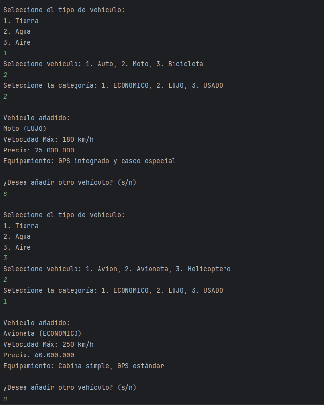
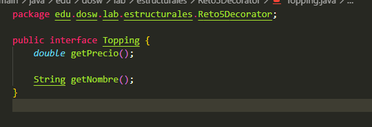
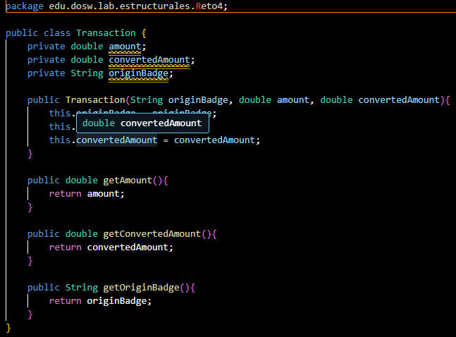
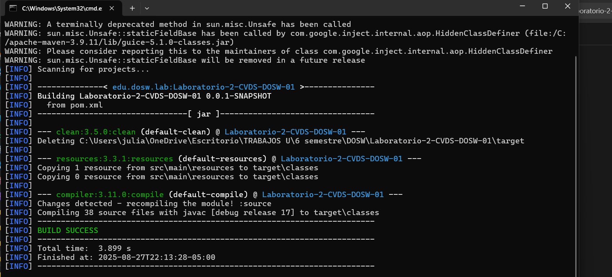
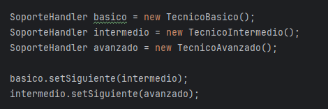
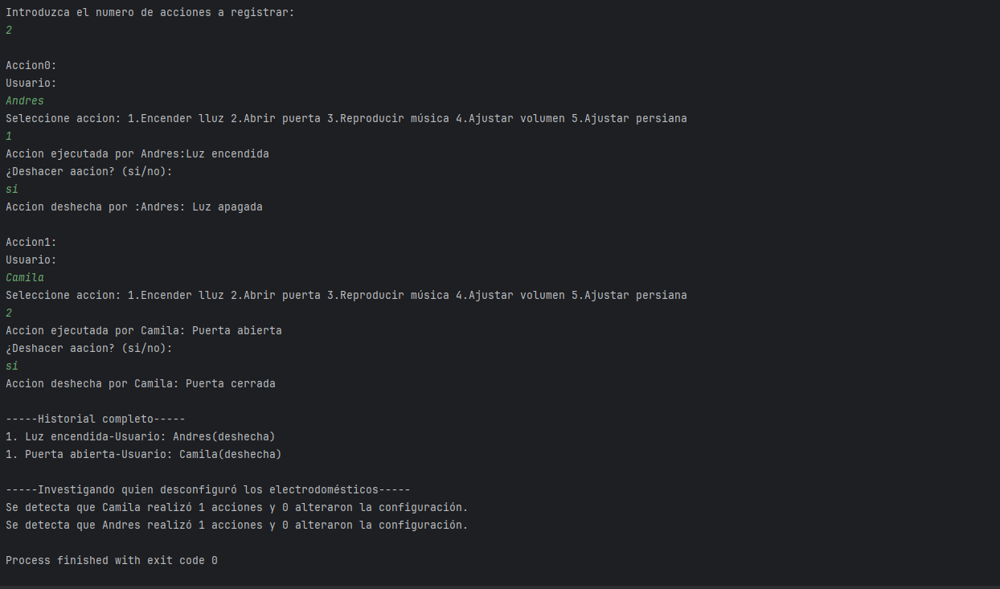
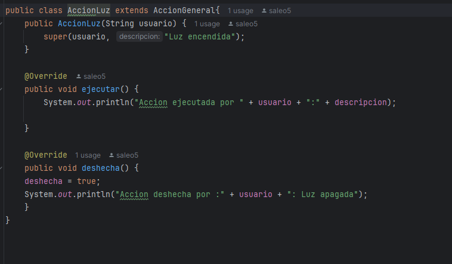

# 🧪 Laboratorio 02 - SOLID, Patrones de Diseño y UML

**Integrantes:**

- Tulio Riaño Sanchez
- Samuel Leonardo Albarracin

**Nombre de la rama:**
'feature/RianoTulio_SamuelAlbarracin_2025-2'

---

## ✅ Retos Completados

## Reto 1 Culminado:

**Evidencia**

---

## Reto 2 Culminado:

**Evidencia**

## Explicacion:

- Patrón de Diseño: Para la solución de este ejercicio se uso un patrón creacional

- Patrón Utilizado: Se empleo Builder

- Justificación: El patrón builder permite construir objetos complejos paso a paso, evitando tener constructores telescopicos, es decir, que tengan muchos parámetros.

- Como lo aplico: El patrón builder esta implementando mediante una interfaz (builder) todos los métodos para construir un objeto, una clase director que es quien orquesta que tipo de objetos crear y una clase respectiva que implementa la interfaz para obtener el objeto esperado en este caso HamburguesaNuevoIngrediente.

**Evidencia**

---

### Reto 3 Culminado:
**Evidencia**

- Patrón de Diseño: Para este punto decidimos hacer uso de un patrón creacional

- Patrón Utilizado y su aplicacion: Usamos el patrón de Factory method, ya que los vehiculos dependían de dos variables como lo eran el tipo del vehiculo, como la categoría, gracias a este patrón nos ahorramos tener un codigo lleno de ifs, verificando cada una de estas variables, todo gracias a las clases Factory que implementamos

tambien, para evitar tantas verificaciones, utilizamos el switch en varias ocaciones, se evidencia en las fabricas, y tambien en las categorias, que definimos como enumeracion, ya que habían solo 3 tipos ya definidos, que no iban a cambiar.
---

### Reto 4:

---

### Reto 5 Culminado:

**Evidencia**

### Explicacion:

- Patrón de Diseño: Para la solución del reto se uso un patrón estructural

- Patrón Utilizado: Se empleo el patrón Decorator.

- El patrón decorator te permite añadir funcionalidades a objetos colocandos especies de encapsuladores que contienen estas nuevas funcionalidades.

- Para aplicar este patrón necesitmos generalizar una interfaz que tenga los métodos que vayan a compartir todos los objetos en este caso se llama Topping con los métodos getPrecio() y getNombre(), luego generalizamos un decorator base que va implementar esta interfaz y va a realizar los llamados correspondientes, a partir de esto añadimos los toppings: cafe, leche, chocolate pero heredando del decorator base y solamente sobreescribiendo sus métodos correspondientes.

**Evidencia**

---

### Reto 6 Completado:
**Evidencia**

**Explicacion:**
- Patrón de Diseño: Comportamiento
- Patrón Usado: Cadena de responsabilidad
- Por que?: porque permite que cada tecnico decida si puede o no resolver el ticket según su nivel y prioridad; si no puede, transmite el ticket al siguiente técnico en la cadena, ademas de proporcionar una forma facil de extender el codigo, si quisieramos agregar otro tecnico por ejemplo
- Como se aplico:
 creamos clase abstracta soportteHandler  y con esto, pudimos definir en cada uno de los tipos de tecnicos, el como manejar los tickets, y saber si los podían resolver o no, como muestra: aqui podemos ver como manejamos los niveles y las prioridades, para ver si podían resolverlo, o si se lo pasaban al siguiente, y por ultimo, iniciamos el metodo de pasar a siguiente:

---

### Reto 7 Completado:
**Evidencia**

**Explicacion:**
- Patron de diseño: Patron de comportamiento
- Patron utilizado: command pattern
- Justificacion: Lo usamos, debido a que para solucionar este reto, vimos que cada accion del control remoto se comportaba como un comando, se podia ejecutar o no, y se debia registrar al historial para la salida
- como se aplico: definimos una interfaz con los metodos a usar por las demas clases 
y en cada uno de los diferentes comandos, o acciones como los llamamos, usamos de distintas formas el como queriamos que actuara, teniendo siempre la opcion de que se ejecuten o no 
---

### Reto 8
