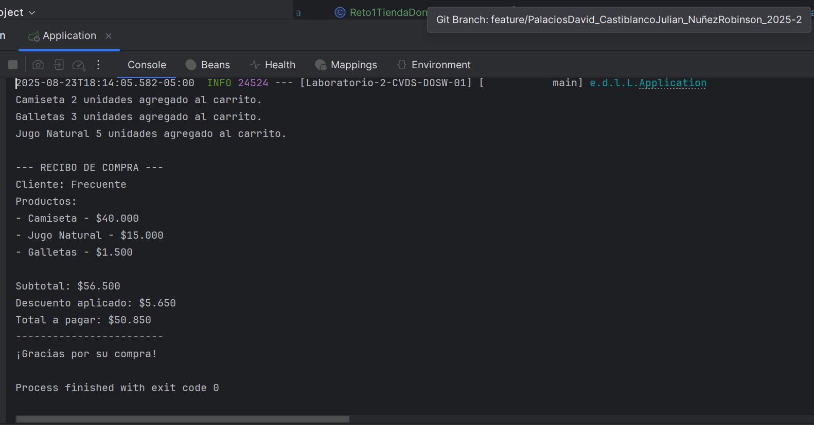
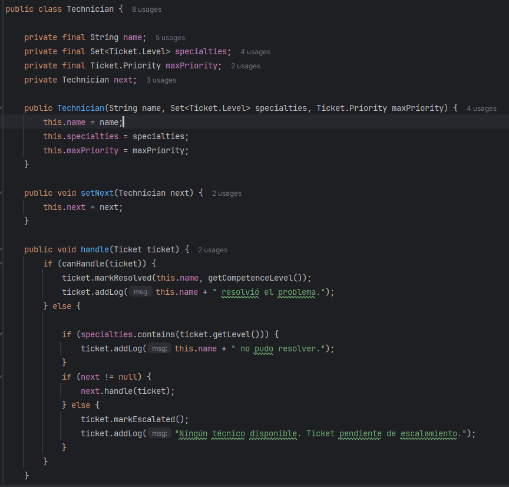
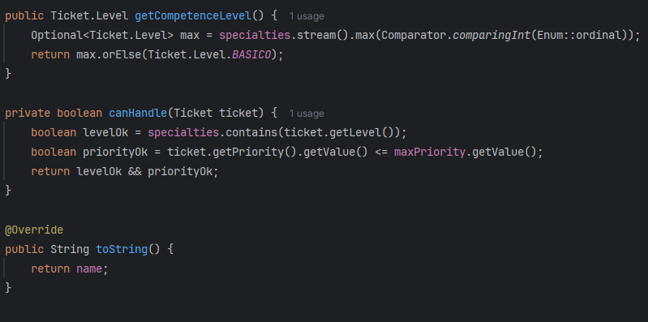
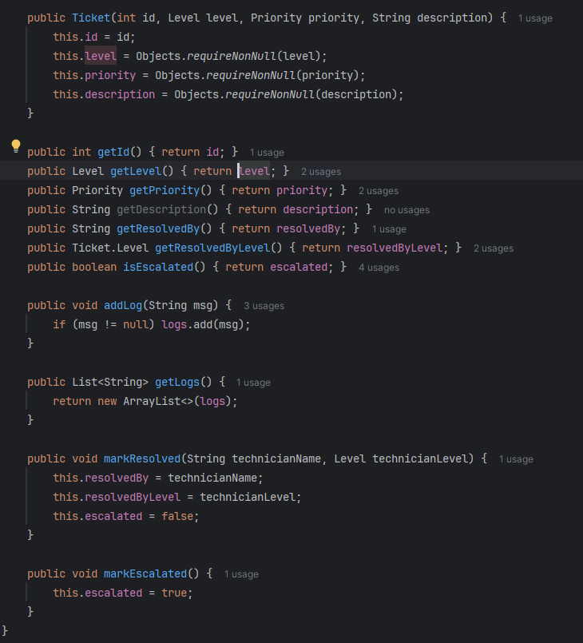
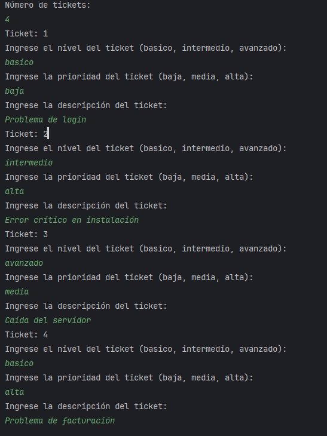
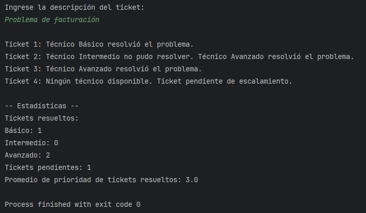

# Laboratorio 02 - SOLID, Patrones de Diseño y UML

**Integrantes**
- Julián David Castiblanco Real
- David Santiago Palacios Pinzón
- Robinson Steven Nuñez

**feature/PalaciosDavid_CastiblancoJulian_NuñezRobinson_2025-2**

---

## ✅ Retos Completados

### RETO #1: El problema de la tienda de Don Pepe

Evidencia:

Descripción: 
Debemos ayudar a Don Pepe ya que no tiene un sistema organizado para manejar sus ventas,
asi que se creo un sistema con los pricipios de solid, como s para que cada clase tuviera 
su única responsabilidad, tambien la d para los clientes. 

### RETO #6: Habla con Soporte Técnico
Evidencia:

📝 Entrada:

📢 Salida:

Descripción: 
Cada ticket tiene un nivel de complejidad el basico, intermedio o avanzado y una prioridad baja media o alta. 
Los técnicos tambien se clasificn en basico, intermedio o avanzado intentan resolver cada ticket en orden, pero si ninguno puede resolverlo, 
el ticket queda pendiente de escalamiento y para eso usamos streams para generar las carateristicas.

***Patrón de diseño:***

- Patrón de diseño: De comportamiento
- Patrón utilizado: Chain of Responsibility
- Justificación : Implementamos un patrón de diseño de cadena de responsabilidad para el procesamiento de tickets. 
Esto permite que una solicitud sea evaluada secuencialmente por múltiples tecnicos hasta que uno la procesa. 
Si ningún tecnico puede hacerse cargo, el ticket llega al final de la cadena y se marca para su escalada.

- Como lo aplicamos: Cuando un ticket se procesa, se invoca el método handleTicket(). Este verifica si el técnico actual puede resolverlo. 
Si es así, se marca el ticket como resuelto y se guarda el nivel del técnico que lo atendió. Si no puede resolverlo, 
el ticket se envía automáticamente al siguiente técnico de la cadena. Finalmente, si ningún técnico logra atenderlo, 
se marca el ticket como pendiente de escalamiento.